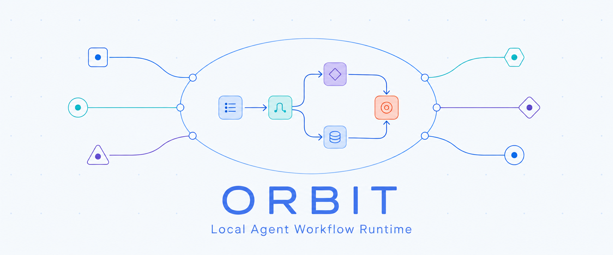

# PromptaFlow

<p align="center">
  
</p>

**简体中文** | [English](./README.md)

PromptaFlow 是面向 Agent App 的本地持久化 LangGraph 工作流 Runtime。固定地址的 Hub 将 API、
Web UI、工作流编写和 MCP 流量路由到每个 Workspace 各自的受管 Runtime 进程。项目数据
保存在 `~/.promptaflow/projects/`。

目前可以从 **Codex app**、**WorkBuddy**、**DeepSeek Harness** 面板，以及任何其他
支持 MCP 的 App 接入——各走各的前门，面对的是同一个 Runtime。Agent 步骤通常 fork
一个已安装的 CLI；也可以改为委托给启动这次 run 的那个对话，那样一个 CLI 都不需要。

## 安装 CLI

需要 Python 3.10 或更高版本，以及 [uv](https://docs.astral.sh/uv/)。

```bash
uv tool install promptaflow      # 或 pipx install promptaflow
uv tool update-shell
```

发行包名是 `orbit-runtime`，它安装出来的命令是 `promptaflow`。两者不同是因为 `promptaflow` 这个名字
在本项目之前就已经被 PyPI 占用；`orbit-runtime` 也正是各集成在 npm 上使用的名字。

从源码运行：

```bash
git clone https://github.com/TNJ2026/promptaflow.git
cd promptaflow
uv sync --extra dev
uv run promptaflow serve
```

Windows PowerShell 也可以使用原生脚本：启动脚本注册当前工作区，重启和停止脚本会处理
Hub 及其发现到的全部 Workspace Runtime：

```bat
start-promptaflow.cmd
restart-promptaflow.cmd
stop-promptaflow.cmd
```

这些 `.cmd` 入口可从 PowerShell、CMD 或资源管理器直接运行，并且不会修改系统的
PowerShell 执行策略。可以先用 `restart-promptaflow.cmd -DryRun` 或
`stop-promptaflow.cmd -DryRun` 查看将处理的进程，不执行停止操作。

启动其他工作区时，将其路径传给启动脚本：

```bat
start-promptaflow.cmd "D:\Develop\your-project"
```

UI 地址为 `http://127.0.0.1:8848/ui`。这个页面列出本机正在运行的 Workspace Runtime
并链接到各自的 UI；它**不启动任何东西**，所以 Runtime 没起来的 Workspace 不会出现在那里。

只有一个 UI、一个目录、一个已发布 Workflow 库。工作流点名哪些 Agent，就在这些
Agent 存在的地方用它们。

已发布的工作流钉住的是编译时那个精确的 Handler 构建，而 Agent 的构建就是它的 CLI
版本——所以在别的机器上写的工作流、或者 CLI 升级之后，它点名的东西可能不在这里。
无处可去的步骤会被送到一个在的 Agent 上，且尽可能少动：优先送到同一个 Agent 已安装
的构建，实在不行才送到本 Runtime 正在对话的那个 Agent。**点名的 Agent 在，就绝不
移动**——所以刻意用两个 Agent 的工作流仍然用两个。

顶替缺席 Agent 的那一个，取自最近一个自报家门的 MCP 客户端；在没有任何客户端连接时，
它保持不变。无从点名时，已发布的绑定原样成立，由编译器说它解不解得开——和这条回退
不存在时完全一样。

已发布的定义**从不被改写**；替换后的图随 run 一起保存，所以在已连接的 Agent 变化之后，
跑完的 run 说的仍然是「当时真正执行它的那个 Agent」。

## 宿主

PromptaFlow 是一个 Runtime，但有好几扇前门。每个宿主接入方式不同、注册的客户端名不同，
是否绘制 PromptaFlow 的卡片也不同。**[每个宿主一页。](./docs/hosts/README.zh-CN.md)**

| 宿主 | 怎么接到 PromptaFlow | 注册名 | 是否绘制卡片 |
| --- | --- | --- | --- |
| [Codex app](./docs/hosts/codex-app.zh-CN.md) | 随插件分发的 stdio Proxy → Hub | `codex-app` | 是 |
| [WorkBuddy](./docs/hosts/workbuddy.zh-CN.md) | 自定义连接器，HTTP 直连 Hub | `promptaflow`，以及 `workbuddy-third-party:custom-mcp:orbit` | 是 |
| [DeepSeek Harness](./docs/hosts/deepseek-harness.zh-CN.md) | 带自有 Gateway 与面板的 Host Profile Bundle | 按 Session 的 `harness:session:*` actor | 自己的面板 |
| [其他 MCP App](./docs/hosts/other-apps.zh-CN.md) | stdio Proxy | 自己的稳定名称 | 取决于宿主 |

客户端名不得遮蔽已发现的 CLI。Runtime 会把已安装的 CLI 发现为 `codex`、`claude` 等
Agent，所以 App 若用其中某个名字注册会被**直接拒绝**而不是改名——`-app` 后缀正是为此存在的。

PromptaFlow 还附带五张可以画在对话旁边的小页面 —— **[卡片](./docs/cards.zh-CN.md)** ——
那里写了每张卡由哪个工具打开，以及升级之后为什么有时看到的还是旧的。

下面的内容，无论从哪儿接入都一样。

## 运行目标

1. 打开 **目标** 页面。
2. 选择一个已发布的 Workflow，或者描述一个、让 Agent 写出来。
3. 输入目标并启动。
4. 在工作台查看每一步进度，或在 **历史** 中检查已完成的运行。

也可以通过 MCP 使用 `list_runs`、`inspect_run`、`start_run` 和 `cancel_run`。
客户端必须遵循 Runtime 返回的 `allowed_commands[]`，不要自行拼接写操作 URL。

## 把目标委托给当前对话执行

通常每个 Agent 步骤都会 fork 它点名的那个 CLI。`execution_mode` 提供另一种安排：
整个工作流照跑，但 Agent 的活儿交给**启动这次 run 的那个对话**去做。

```text
start_run(workflow_id=..., goal=..., execution_mode="current_app")
```

Runtime 会把这次 run 里每个 `agent.*` 节点改绑到 `app.delegate` Handler，
`target` 为 `run_initiator`，并且**不动已发布的定义**——端口、边、映射、回边、条件和
提示词原样保留，不必为了把 `prompt` 改名成 `task` 而重写任何东西。替换后的图随 run
一起保存，所以跑完的 run 说的仍然是「实际执行它的是什么」。并行分支同样包含在内，
整个过程不需要安装任何 CLI。

这个模式**总是异步返回**。跟进这次 run 就是处理队列：

- `claim_delegation` 为本会话租约最早排队的那条委托并返回请求；在对话里把它执行掉。
- `renew_delegation` 续租，并观察是否已被取消。
- `checkpoint_delegation` 记录最新的安全恢复点，并在同一步里续租。
- `complete_delegation` 提交结果——或者错误。

队列按 actor 隔离，所以别的对话拿不走这个对话的活。它同时也是**幂等边界**：一个确定性的
delegation id 最多只能被认领一次；租约过期后会变成 `unknown`，而不是交给第二个 Agent。
`reconcile_delegation` 为 `unknown` 的那条记录提供一个人工裁决，它**从不重试、也不改写**原来
那次尝试——因为那次尝试很可能真的发生过。

因为 run 的寿命长于对话，每个受支持的宿主都会在**对话的第一个用户轮次**检查有没有可恢复
的工作：用默认状态调一次 `list_delegations`，为空则不作声，非空则告知用户并询问。一条仍在
租约中、且属于同一个稳定 worker 的委托，可以在续租后从它的 checkpoint 继续。

`app.delegate` 也可以**直接写进工作流**，而不必经由 `execution_mode`。它的输入端口叫
`task` 而不是 `prompt`，`config.target` 必须是 `run_initiator`。有两条约束来自「App 能
产出什么」：节点必须是 `action` 且唯一输出为 `result`；如果输出是 artifact，它必须接受
`text/*` 或 `application/json`。旁边的 `harness.subagent` 是给 Harness 托管的 Subagent
Provider 用的，那里的 provider 写在委托请求里，而不是固定在注册表中。

## Run、事件与输出

Runtime 事件可通过 `wait_app_event`、`list_app_events` 和 `ack_app_event` 处理。
这三个是 **stdio Proxy 自己的工具**，所以 Codex app 以及用同样方式接入的 App 有它们，
而直接和 Hub 对话的宿主没有——Runtime 自己的事件工具是 `list_runtime_events`。
`event_type` 为 `langgraph_run.<status>`（run 状态变化）或
`langgraph_node.<outcome>`（单次 Handler 尝试，另带 `node_id` 和 `attempt_id`）。
节点事件只来自带尝试日志的 Handler —— 即那些执行本身是不可重复的外部效果的 —— 所以
重放的 superstep 不会产生事件。
事件只是提示，执行操作前应重新读取对应 Run。

run 在启动它的那个请求里执行。`POST /api/v1/langgraph-runs` 带 `"wait": false`
时，run 一创建就返回，执行放到后台 —— UI 用的就是这条，页面才能看着自己启动的目标。
两种方式下"这个 run 能不能存在"都已经判定完毕；等待换来的只是知道它**怎么结束的**。

每个 actor 同时只跑一个目标：当已有 `running`、`waiting` 或
`interrupted` 的 run 时，再启动会以 `active_goal_exists` 拒绝，并在拒绝里带上占用
该槽位的 run，客户端可以直接跳过去。取消或结束即释放。

run 默认永久保留。`/api/v1/ops/status` 报告引擎占用的容量；
`create_app(run_retention_days=N)` 会忘掉结束超过 N 天的 run —— 按**整个 run**
删除，因为缺了控制台或 checkpoint 的 run 会错误地描述自己。等待人工输入的 run、
以及 Handler 以 `unknown` 结束的 run，永远不会被忘掉。

Handler 进程打印的内容通过
`GET /api/v1/langgraph-runs/{run_id}/output?after=<chunk_id>` 读取，需要 sensitive
scope。它是控制台而非日志：按尝试和流分别限量、写在所有事务之外，且永远不参与重放。

## CLI 快速参考

```bash
promptaflow serve
promptaflow serve --project-root /absolute/path/to/project
promptaflow hub register /absolute/path/to/project --no-agent-project-access
promptaflow --version
promptaflow runtimes --json                     # 哪些 Runtime 在跑、在哪
promptaflow mcp
promptaflow mcp --project-root /absolute/path/to/project
promptaflow run list
promptaflow run inspect <run_id>
promptaflow workflow validate <file> --catalog <catalog.json>
promptaflow workflow publish <file> --catalog <catalog.json> --expected-version <n>
```

`promptaflow serve` 是统一入口：它会复用或启动绑定在 `127.0.0.1:8848` 的 Hub、注册当前
Workspace，并等待 Hub 管理的 Runtime 就绪。它不再提供独立 Runtime 模式。多 Workspace 时，Agent CLI、Workflow 源码模板
和已发布 Workflow 全局共享；运行历史、人工任务、Artifact 及其他执行状态仍按 Workspace
隔离。Hub 还持有可复用的 Workflow 源码模板，并聚合在线 Workspace Runtime 的 Agent 统计。

## Codex 插件分发

PromptaFlow 仅通过仓库/个人 Marketplace 分发，不提交到通用公共 Plugins Directory。
完整步骤见 [Codex App 安装指南](./docs/hosts/codex-app.zh-CN.md)，其中也提供了让 Codex
直接从本仓库安装的一行提示词。

每个 GitHub Release 都包含 `promptaflow-marketplace-<version>.zip`。下载并解压后，注册解压目录并
安装 PromptaFlow：

```bash
unzip promptaflow-marketplace-<version>.zip
codex plugin marketplace add ./promptaflow-marketplace
codex plugin add promptaflow@promptaflow-local
codex plugin list
```

请把解压出的 `promptaflow-marketplace` 目录保存在稳定位置，因为已配置的 Marketplace 源会引用
该目录。升级时下载并解压新版本、替换旧目录，然后运行：

```bash
codex plugin add promptaflow@promptaflow-local
```

最后完全退出并重新打开 Codex 桌面应用，再新建任务，让 Codex 重新加载插件元数据和技能。

## 开发

```bash
uv sync --extra dev
.venv/bin/python -m unittest discover -s tests
node --test tests/ui/client_modules.test.mjs
```

每个 GitHub Release 都包含 Marketplace ZIP、独立 Codex 插件 ZIP、Python wheel
和源码包，以及 DeepSeek Harness bundle。构建 Python 包和插件包：

```bash
uv build
python scripts/build-marketplace-release.py \
  --version 2.0.0 \
  --output dist/promptaflow-marketplace-2.0.0.zip \
  --plugin-output dist/promptaflow-plugin-2.0.0.zip
```

推送 `2.0` 或 `v2.0.0` 这样的标签后，Release workflow 会把两段版本规范化为
`2.0.0`，检查它与 `src/promptaflow/__init__.py` 的版本是否一致、运行测试，并把全部
分发产物上传到 GitHub Release。也可以为已有标签手动运行；重复运行会覆盖上传的
产物。PyPI 发布只在手动运行时按需勾选，并要求事先配置 Trusted Publisher；普通
标签发布仅分发到 GitHub。
