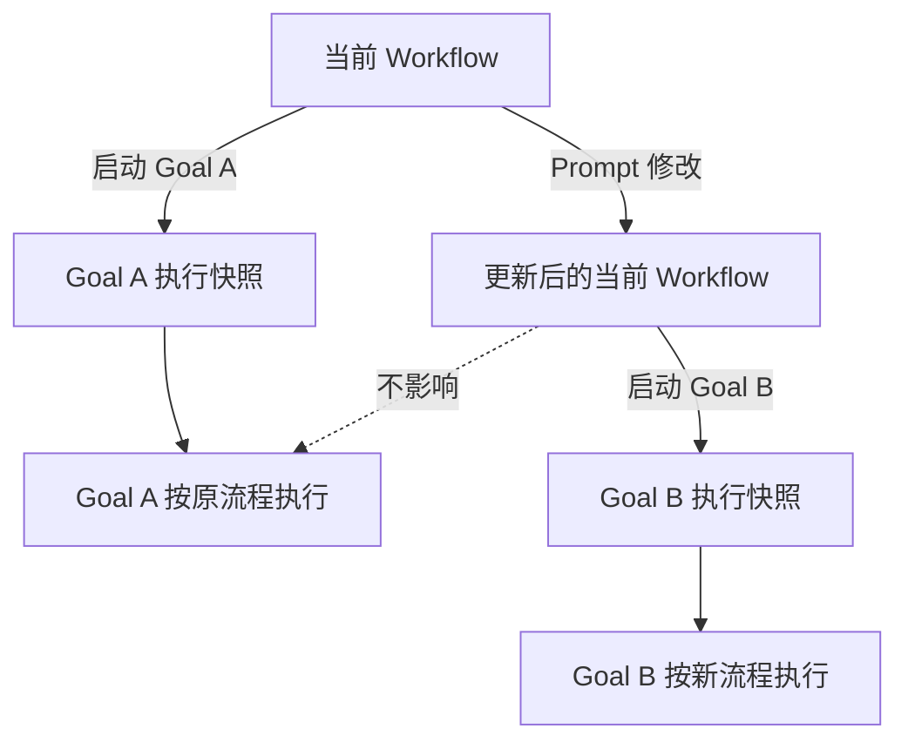
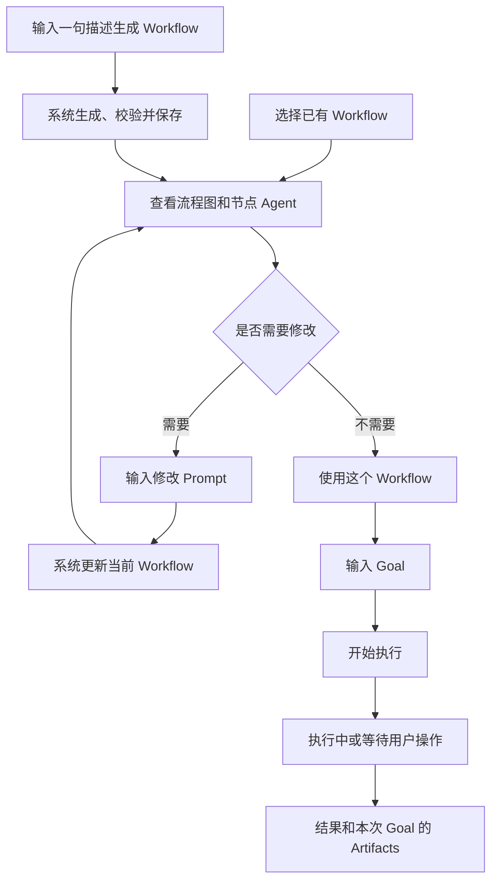

# 简化版 Goal Workflow 产品需求

## 1. 文档目的

本文定义 Orbit 面向普通用户的核心使用流程和页面需求。产品围绕 Goal
组织体验，隐藏 Runtime、版本、Handler、Schema、DSL 等实现概念，同时保留：

- 选择或生成 Workflow；
- 查看 Workflow 流程图；
- 查看每个节点使用的 Agent；
- 通过 Prompt 修改 Workflow；
- 输入 Goal 并开始执行；
- 处理执行过程中必要的用户操作；
- 执行完成后查看结果和本次 Goal 产生的 Artifacts。

本文描述目标产品语义，不要求删除供 CLI、MCP、审计或运维使用的底层能力。

## 2. 核心原则

### 2.1 Workflow 优先

用户先选择或生成 Workflow，再输入 Goal。

```text
选择/生成 Workflow
→ 查看并按需修改 Workflow
→ 输入 Goal
→ 开始执行
→ 查看结果和 Artifacts
```

### 2.2 尽量减少输入

使用已有 Workflow 时，普通用户原则上只输入 Goal。

生成 Workflow 时，用户只输入一句用途描述。系统自动选择生成 Agent、执行
Agent、节点结构、输入输出、重试策略和其他技术配置。

### 2.3 不提供高级选项

普通 UI 不展示或要求用户配置：

- Workflow 版本；
- Workflow ID、definition hash；
- Handler 及 Handler 版本；
- Writer Agent、默认 Agent 选择器；
- DSL 或 canonical IR 源码；
- Schema ID；
- JSON 输入；
- Draft、Validate、Publish 等发布阶段；
- Plan、Timeline、Graph、Data、Errors 等独立技术视图；
- Budget 明细、Recovery 诊断、Agent Output 等 Runtime 管理信息；
- Artifact ID、producer、lineage、content type 等技术元数据。

Budget 和 Recovery 不提供独立管理页面，但凡它们阻塞当前 Goal，必须作为当前
Goal 的内联责任显示，并提供服务端授权的处理命令，不能因为隐藏高级页面而让
运行失去出口。

### 2.4 Workflow 对产品永远表示当前定义

产品不区分、展示或选择 Workflow 版本。一个 `workflow_id` 对用户只代表一个
当前定义。

本需求采用以下存储策略并写死为方案 A：

- 内核继续保留不可变 `workflow_versions` 历史；
- `workflow_runs (workflow_id, workflow_version)` 的现有绑定保持不变；
- execution plan 和历史 Run 继续引用启动时的不可变定义；
- 产品 API 不接受 Workflow 版本选择；
- 产品 API 不返回版本列表；
- 普通 UI 不展示版本号，也不能浏览、选择或回滚历史定义；
- Catalog 和 Workflow 详情只返回当前最新定义。

因此，“移除版本”只表示**移除产品可寻址性和用户心智**，不表示删除
`workflow_versions` 表，也不触发 Run、Plan 外键或历史数据迁移。

用户通过 Prompt 修改 Workflow 后，系统发布新的内部不可变版本，并使其成为
产品所见的当前定义。`v1`、`v2`、`latest_version`、`selected_version` 等字段
不进入普通 UI；内部仍可使用版本完成持久化、并发控制、审计和 Run 绑定。

### 2.5 已开始的 Goal 使用不可变执行快照

修改 Workflow 只影响修改完成后新启动的 Goal。

- 正在执行的 Goal 继续按启动时的 Workflow 执行；
- 已完成的 Goal 保留当时实际执行的流程；
- 下一个 Goal 使用更新后的 Workflow；
- Workflow 页面展示当前流程；
- Goal 页面展示该 Goal 实际使用的流程。



## 3. 用户主流程



## 4. 信息架构

本产品形态以前置启用 `single_goal_mode=true` 为条件。若部署允许同时运行多个
顶层 Goal，则不能移除全局 Inbox，因为只在当前 Goal 内联责任会漏掉其他 Run
的待办。

简化 UI 即唯一 UI 形态（完整 Runtime 控制台已移除）；`/api/v1/capabilities`
仍声明 single-goal 语义，不根据页面状态猜测：

```json
{
  "data": {
    "product_mode": {
      "single_goal_mode": true
    },
    "permissions": {
      "human_token_required": false
    }
  }
}
```

- 本文导航始终适用；`single_goal_mode=true` 时一次只推进一个 Goal（服务端
  以 409 `active_goal_exists` 拒绝第二个）；
- `permissions.human_token_required` 继续使用现有字段，不在 `product_mode` 重复
  定义，并控制 §5.5 的内联取令牌步骤。

`single_goal_mode` 由部署者通过 `orbit serve` 启动参数或对应部署配置设置，
并在进程生命周期内保持不变。`/api/v1/capabilities` 只负责报告最终生效值；
UI 不设置、覆盖或推断该标志。（`simplified_goal_ui` 标志已随完整 UI 一同
移除。）

单目标模式下，普通 UI 最多保留三个一级入口：

1. **Workflow 与 Goal**：选择 Workflow、启动 Goal、查看执行状态和结果；
2. **历史记录**：查看过去的 Goal 及其结果；
3. **设置**：只包含语言、主题等普通用户确实能够改变的选项。

简化模式的设置页不包含当前合并在 Settings 下的 Ops、恢复、完整性或 Runtime
运维分区。

以下能力不在普通 UI 提供独立入口：

- Workflows 管理后台；
- 全局 Inbox；
- 全局 Artifacts Catalog；
- Agents；
- Ops。

等待用户处理的事项直接显示在当前 Goal 页面，而不是要求用户进入 Inbox。

## 5. 页面需求

### 5.1 Workflow 选择页

页面直接展示可用 Workflow：

```text
选择一个 Workflow

[销售报告生成]
自动分析数据并生成报告

[资料调研]
收集、验证并整理资料

[＋ 生成 Workflow]
```

Workflow 卡片只展示：

- 名称；
- 一句话用途描述；
- 简洁流程摘要（可选）。

不展示节点数量、输入数量、版本或技术标识。

目录同时展示可执行、可自助升级和无法升级的只读 Workflow：

```text
[旧版资料整理]  需要升级
升级后才能开始新的 Goal

[升级这个 Workflow]

[旧版归档流程]  无法升级
此 Workflow 没有作者源码，无法升级；请生成新的 Workflow

[生成新的 Workflow]
```

- `ready`：主按钮为“使用这个 Workflow”；
- `needs_upgrade`：定义可读且 `source_available=true`，可以打开、查看流程图和
  Prompt 升级，但不能启动 Goal；主按钮为“升级这个 Workflow”；
- `needs_migration`：`source_available=false`，仍可查看流程图，但没有升级或启动
  按钮。该状态在本需求范围内是终态只读，页面唯一出口为“生成新的 Workflow”；
  系统不承诺通过运维操作恢复或重新发布该定义。

“升级这个 Workflow”点击后聚焦 Prompt 输入，并用当前 UI 语言通过 i18n 预填
“升级此 Workflow，使其可以在简化模式下运行并声明最终结果”。默认使用
`workflow.modify(mode=modify)`；若修改失败，页面提示用户可选择
`mode=regenerate` 的“重新生成”。升级成功后原目录项变为 `ready`。

如果 Workflow 数量较多，可以提供名称搜索，但不提供排序、状态、Agent 等高级
筛选。

一个 Workflow 都没有时展示：

```text
还没有可用的 Workflow

描述你希望系统如何工作，生成第一个 Workflow。

[生成 Workflow]
```

### 5.2 Workflow 生成

点击“生成 Workflow”后只显示一个输入框：

```text
这个 Workflow 应该如何工作？

[收集指定主题的资料，交叉验证信息，并生成 Markdown 报告]

[生成]
```

异步 Job 内部自动完成：

1. 选择可用的 Workflow 生成 Agent；
2. 选择节点使用的 Agent；
3. 生成 Workflow 定义；
4. 编译和验证；
5. 自动接受候选；
6. 发布新的内部不可变版本，使其成为当前 Workflow。

Job 进入用户可见的 `done` 后，UI 打开 Workflow 可视化页面。

页面显示“排队中/生成中”并允许取消。失败、取消、超时后停留在描述页并保留用户
Prompt，便于修改或重试；不得静默重复调用 Agent。用户不需要单独执行 Publish，
也不需要查看 Draft 或源码。

生成 Agent 的输出契约必须要求：

- Workflow 名称、节点名称和步骤摘要使用当前用户界面语言；
- 名称表达业务动作，不使用 `transform`、`collect`、`node_1` 等内部命名；
- 每个节点包含可展示的名称及所用 Agent；
- Workflow 满足单一 Goal 可启动规则；
- Workflow 显式声明结果输出，规则见 §7.4。

### 5.3 Workflow 可视化与 Prompt 修改

生成或选择 Workflow 后，页面展示流程图和每个节点的 Agent：

```text
资料调研报告

┌──────────────┐     ┌──────────────┐     ┌──────────────┐
│ 收集资料      │ ──→ │ 验证与整理    │ ──→ │ 生成报告      │
│ Research Agent│     │ Analysis Agent│     │ Writer Agent  │
└──────────────┘     └──────────────┘     └──────────────┘

[通过 Prompt 修改 Workflow........................]
[修改]

                                        [使用这个 Workflow]
```

“重新生成”不与“修改”并列展示。它允许系统重建整个流程，是比修改更大的动作，因此
只在一次修改真正失败之后才出现，见 §5.3 的失败路径。

流程图必须展示：

- 用户可理解的节点名称；
- 节点之间的方向和连接；
- 每个执行节点使用的 Agent；
- 起点和结束节点。

用户通过自然语言修改整个 Workflow，例如：

```text
在生成报告前增加事实核查步骤，并让 Writer Agent 输出 PDF。
```

系统基于当前定义应用修改，编译验证成功后替换当前 Workflow，并刷新流程图。

修改是异步 Job，不是一次长时间占用的同步 HTTP 请求。页面必须表达：

```text
正在修改 Workflow…
[取消修改]
```

内部异步生命周期固定为：

```text
queued → running → candidate → accepted
queued → cancelled
running → cancelled
candidate → rejected
```

- `queued`、`running`：显示进行中并允许取消；
- `candidate`：候选定义已生成并通过编译，系统立即自动执行最终接受；进入该内部
  状态后不再接受取消命令；
- `accepted`：发布新的内部版本，成为当前定义；
- `rejected`：候选无效或业务校验失败，当前定义保持不变；
- `cancelled`：停止后续处理，当前定义保持不变。

普通 UI 不展示 `candidate`，也不提供接受或拒绝按钮。用户可见状态固定为：

```text
queued → running → done
                 ├→ failed
                 └→ cancelled
```

内部 `accepted` 映射为 `done`；内部 `rejected`、超时及不可恢复错误映射为
`failed`。用户只负责提交 Prompt 或取消，不参与 Draft、Validate、Publish 和
候选接受。

单次生成或修改的默认截止时间为 5 分钟；部署可以配置上下限，Job 响应必须通过
`deadline_at` 返回本次实际截止时间。超时按失败处理，不接受候选：修改 Job
保持当前定义不变，生成 Job 不创建 Workflow。

修改 Job 不属于 Run，不能复用挂在 Run 上的 recovery responsibility。除用户
主动取消路径外，若 Agent 产生 unknown result，Job 一律收敛为用户可见的
`failed`：

- 当前 Workflow 定义保持不变；
- 不自动重试，也不自动接受稍后到达的输出；
- 记录 Job、请求指纹、Agent 调用信息和 unknown 原因到审计；
- Workflow 页面显示“修改结果无法确认，请重新提交修改”；
- 不创建 Run recovery 待办，也不依赖已移除的全局 Inbox。

取消 `running` Job 时，服务端必须请求停止 Agent CLI 子进程并等待既定的终止
宽限期。若无法确认 Agent 是否已经产生输出，取消路径按 unknown result 的安全
规则处理，但用户意图仍是取消：

- Job 终态为 `cancelled`；
- 当前 Workflow 定义保持不变，生成 Job不创建 Workflow；
- 写入 unknown/cancel 审计；
- 不接受取消后到达的 candidate；
- 不自动重试。

同一 Workflow 同时只允许一个活动修改 Job。第二个修改请求返回已有 Job，或以
既有的 `draft_already_active` 拒绝，不能并行生成两个候选并让完成顺序
决定当前定义。

页面刷新后必须能重新发现活动 Job：

- Workflow Catalog/detail 对每个 Workflow 返回可选 `active_job`；
- `active_job` 至少包含 job id、用户可见状态、deadline 和读地址；
- 当前 actor 的无 Workflow 锚点生成 Job 通过
  `GET /api/v1/workflow-authoring-jobs?mine=true&active=true&type=generate`
  发现；
- UI 启动时读取上述入口，恢复进度和取消按钮；
- Job 终态仍可按 job id 读取，直到 UI 已展示终态，不能只存在于创建响应。

修改成功时展示用户可理解的变更摘要：

```text
修改完成

+ 新增“事实核查”步骤
~ “生成报告”现在输出 PDF
```

用户不直接编辑节点属性。修改 Agent、增加节点、删除步骤或改变输出均通过
Prompt 完成。

变更摘要由修改 Agent 随候选定义返回结构化数据，服务端在接受候选前校验摘要中
引用的节点确实存在。结构 diff 只用于校验和降级；Agent 未返回可用摘要时，服务端
按固定模板生成“新增/删除/修改了哪些步骤”，前端不自行比较两张图，也不生成另一
套摘要。

“修改”和“重新生成”的语义不同：

- **修改**：尽量保持当前结构，仅应用 Prompt 指定的变化；
- **重新生成**：调用同一个 `workflow.modify`，传入 `mode=regenerate`，允许系统
  重新设计整个 Workflow，但保持同一个 `workflow_id`，发布新的内部版本，并且
  只影响之后启动的 Goal。

`workflow.generate` 只用于创建新的 Workflow 目录项，不用于已有 Workflow 的
“重新生成”按钮。重新生成与普通修改共享同一活动草稿约束和并发规则。

重新生成的入口只在修改失败后出现，规则固定为：

1. 页面初次打开修改对话框时只提供“修改”，不展示“重新生成”；
2. Job 进入 `failed` 后，页面提供“重试”，回到 Prompt 且保留原文；
3. 只有这次重试的表单才同时提供“修改”和“重新生成”，并说明重新生成允许系统重新
   设计整个流程；
4. 用户始终可以只再改一次 Prompt 而不使用重新生成。

这条规则的理由是重新生成会丢弃作者已经接受的结构：在还没有证据说明保留结构行不通
之前提供它，等于把最大的动作放在最容易误触的位置。

当存在正在执行的 Goal 时，页面固定提示：

> 修改后的流程将从下一个 Goal 开始使用，当前正在执行的 Goal 不会改变。

### 5.4 Goal 输入与启动

点击“使用这个 Workflow”后只显示：

```text
销售报告生成

你想完成什么？

[分析本季度销售数据，找出增长最快的产品并生成报告]

[返回]                                         [开始执行]
```

删除原有多步 Wizard、独立 Review 页面和 Start 确认页。

普通 Workflow 必须同时满足以下条件：

- Goal 已绑定到主输入；
- Goal 之外没有其他必填顶层输入，或这些输入都有默认值；
- 执行中需要追加的信息由 Workflow 自己通过 HumanTask 询问，不作为缺失的顶层
  启动输入。

Catalog 应由服务端明确标记 Workflow 是否可通过单一 Goal 启动，例如：

```json
{
  "goal_readiness": "needs_upgrade",
  "readiness_reason": "primary_result_missing",
  "source_available": true
}
```

`goal_readiness` 是唯一权威字段，取值域固定为：

| 值 | 含义 | 主操作 |
| --- | --- | --- |
| `ready` | 可以用单一 Goal 启动 | 使用这个 Workflow |
| `needs_upgrade` | 不可启动，但有源码可 Prompt 升级 | 升级这个 Workflow |
| `needs_migration` | 不可启动且无源码，是终态只读定义 | 生成新的 Workflow |

不再返回或使用 `ready_for_goal`。若兼容旧客户端必须暂时保留，它只能是
`goal_readiness == "ready"` 的只读派生别名，不能成为第二个判断来源。

服务端先按以下规则计算启动就绪性：

1. Goal 已绑定到一个输入；并且
2. 除 Goal 输入外没有其他 required 输入，或 required 输入都有默认值；并且
3. Workflow 存在符合 §7.4 的显式结果输出，或属于 §7.4.1 明确定义的 DSL 1.2
   单 terminal/单输出过渡兼容范围。

任一规则失败时，`readiness_reason` 按上述规则顺序返回第一个原因，枚举固定为：

- `goal_binding_missing`；
- `required_input_without_default`；
- `primary_result_missing`；
- `primary_result_ambiguous`；
- `dsl_upgrade_required`。

规则 3 内部的判定顺序固定为：

1. DSL 1.0 缺少显式结果声明：`dsl_upgrade_required`；
2. DSL 1.2 存在多个 terminal 或候选 terminal 存在多个输出端口：
   `primary_result_ambiguous`；
3. 其余缺少或包含无效结果声明的情况：`primary_result_missing`。

规则失败且 `source_available=true` 时返回 `needs_upgrade`；规则失败且
`source_available=false` 时返回 `needs_migration`。定义损坏或 actor 无权读取的
Workflow 才不进入普通目录。

`readiness_reason` 只用于迁移盘点、日志、审计和运维诊断，不直接进入普通 UI
文案。普通 UI 只按 `goal_readiness` 显示经过 i18n 的固定文案，不要求为每个
reason 设计一套用户提示。

前端不得自行读取 Schema 重复实现该判定。

### 5.5 执行中

启动后，当前页面原地转为执行状态：

```text
分析本季度销售数据，找出增长最快的产品并生成报告

● 正在执行
正在整理销售数据

[取消]
```

执行页默认只显示：

- Goal；
- 当前状态；
- 当前用户可理解的步骤；
- 取消操作。

“当前步骤”来自 §7.5 的服务端投影，不由前端读取 Plan、Graph 或 Timeline 自行
推断。这三个技术视图在普通模式已被移除，产品页面不得绕过 §7.5 去访问它们。

页面进度复用现有 `GET /api/v1/live` 游标：UI 携带上次游标轮询，收到变更后重新
读取当前 Goal 的状态、当前步骤和责任，不为简化模式新增第二套推送或轮询机制。

如果执行需要用户补充信息或确认，直接显示在当前页面：

```text
需要补充信息

请选择需要分析的时间范围：
[最近一个季度]

[继续]
```

系统采用“需要时再问”，不在启动前要求用户填写全部参数。

以下阻塞责任即使属于高级 Runtime 能力，也必须按 Runtime 的 responsibility
kind 一一映射并内联显示：

- `human`：显示问题及服务端下发的回答/确认命令；
- `budget`：显示“执行额度不足”，并提供服务端下发的追加预算或终止命令；
- `recovery`：显示“执行需要恢复处理”，并提供服务端下发的安全恢复、接管或
  终止命令；
- `unknown`：不得伪装成普通失败，显示需要确认或恢复的状态。

所有操作必须来自该责任的 `allowed_commands[]`，UI 不自行拼接 URL、命令名或
并发令牌。

普通模式默认要求本地操作 actor 属于 Human token 豁免范围。若 capability 中
`human_token_required=true`，内联 `human` responsibility 必须先展示取得或输入
任务令牌的步骤；验证后才能执行回答命令。“继续”按钮不能绕过现有 HumanTask
authority。

取消命令被 Runtime 接受后，页面进入稳定的“已取消”状态，不继续显示“正在
取消”或提供重复取消按钮：

```text
已取消

这个 Goal 没有执行完成。

[重新开始] [选择其他 Workflow]
```

取消前已经提交的 Artifacts 可以继续显示在“已生成的内容”区域，但页面不生成
成功结果，也不把部分输出标记为 outcome。

### 5.6 完成结果

Goal 完成后，同一页面显示：

```text
✓ 已完成

结果

本季度销售额增长 18%，主要增长来自……

生成的内容

[季度销售报告.pdf]
[销售趋势图.png]
[汇总数据.csv]

[开始新的 Goal]
```

展示顺序：

1. 执行结果；
2. 本次 Goal 产生的 Artifacts；
3. 开始新 Goal。

如果没有 Artifact，只显示简短提示：

> 此次执行没有生成文件。

历史 Run 返回 `result.state=unavailable_legacy` 时显示：

```text
结果内容不可用

这个 Goal 使用的是旧版流程，未声明可展示的最终结果。
```

页面仍正常展示该 Run 的 Artifacts，不把该状态显示成执行失败。

普通 UI 使用“生成的内容”或“文件”等用户文案，可以在内部继续称为 Artifact。

点击 Artifact 后：

- 图片直接预览；
- 文本直接阅读；
- 其他文件提供下载。

Artifact 模型需要新增可选 `filename` 字段，由产生 Artifact 的 Handler 提供，
服务端负责清理路径并只保留安全文件名。完成页命名规则为：

1. 有 `filename`：显示文件名；
2. 无 `filename` 但有文档标题：显示标题和类型图标；
3. 两者都没有：显示 `output_port_id` 和类型图标。

不得由前端根据 content type 虚构 `.pdf`、`.csv` 等扩展名。

目标 UI 必须恢复非预览文件的下载入口。当前 Artifact 弹窗尚未满足本节要求：
仍显示 Artifact ID、producer、content type、lineage，且缺少下载入口；这些属于
明确的实现差距，而不是保留行为。

普通 Artifact 弹窗隐藏上述技术元数据，但保留一个次要的“复制标识”动作，将
`artifact_id` 复制到剪贴板供报障引用。标识不作为标题或普通信息展示。

### 5.7 历史记录

历史记录是 Goal 历史，不是 Run 运维列表。默认按最近更新时间倒序分页展示：

历史只收录终态顶层 Goal：

- `succeeded` → 已完成；
- `failed` → 未完成；
- `cancelled` → 已取消。

当前处于 created、running、waiting、waiting_for_budget 或 recovery/unknown 的
Goal 只显示在“Workflow 与 Goal”入口，不重复出现在历史列表。单目标模式下最多
只有一个这样的当前 Goal。

```text
历史记录

[✓] 分析本季度销售数据             销售报告生成
    已完成 · 7 月 23 日

[×] 整理客户反馈                   资料调研
    已取消 · 7 月 22 日

[!] 汇总竞品信息                   资料调研
    未完成 · 7 月 21 日
```

列表项只展示：

- Goal 标题；
- 用户可理解的状态；
- Workflow 名称；
- 更新时间；
- 是否有结果或 Artifacts。

提供一个按 Goal 文本搜索的输入框，不提供 Workflow version、responsibility、
Agent、Plan 或技术状态筛选。

点击历史 Goal 打开只读详情，展示：

1. Goal 和最终状态；
2. outcome；
3. 该 Run 的 Artifacts；
4. 该 Goal 实际使用的流程图和节点 Agent，默认折叠。

详情必须读取 Run 固化的 Workflow/plan，而不是当前 Workflow。历史详情不提供
修改 Workflow、取消或责任处理操作。

`result.state=unavailable_legacy` 时，列表显示“结果不可用”，但若存在 Artifacts
仍显示“有生成内容”；详情使用 §5.6/§8.6 文案并正常加载 Artifacts。

如果没有历史 Goal：

```text
还没有历史记录

完成、失败或取消的 Goal 会显示在这里。
```

## 6. Workflow 当前定义与执行快照

### 6.1 当前 Workflow

内核继续使用现有不可变版本模型：

```text
workflow_definitions
└── workflow_versions (workflow_id, version, definition_hash, definition...)

workflow_runs
└── (workflow_id, workflow_version) → workflow_versions
```

不引入替代性的 `workflows` 当前值单表，也不删除历史版本。Catalog 通过读取每个
Workflow 的最新内部版本形成“当前定义”投影。

内部版本与 `definition_hash` 继续用于：

- Run 的不可变定义绑定；
- execution plan 构建和审计；
- 乐观并发控制；
- 故障恢复和历史一致性校验。

它们不在普通 UI 展示，也不能由普通产品 API 用作历史选择器。

### 6.2 Goal 执行快照

启动 Goal 时，系统必须在一致性边界内：

1. 解析 Workflow 当前最新的内部不可变版本；
2. 校验定义仍然可执行；
3. 创建 Run，并通过现有 `(workflow_id, workflow_version)` 绑定该定义；
4. 生成并保存不可变 execution plan；
5. 将 Run 与该 plan 绑定。

概念模型：

```text
Workflow = 可被 Prompt 修改的当前模板
Run/Goal = 启动时固化的执行实例
```

Workflow 更新后发布新的内部版本。既有 Run 仍引用旧版本和自己的 execution
plan，不重新规划、不迁移、不改变任何已经启动的 Run。

### 6.3 并发语义

启动 Goal 和修改 Workflow 同时发生时：

- 如果启动先取得当前定义，Goal 使用修改前的流程；
- 如果修改先提交成功，Goal 使用修改后的流程；
- 不允许 Run 读取到部分旧定义和部分新定义。

产品不展示版本，但后端继续使用项目统一写协议：

- 每个写请求带 `idempotency-key`；
- 请求体带服务端 `allowed_commands[]` 下发的 `expected_version`；
- UI 原样执行服务端返回的 method、href、target 和并发令牌；
- UI 不生成、不解释、不展示 `expected_version`。

不新增 `expected_definition_hash` 并发协议。

冲突时普通用户只看到：

> Workflow 已发生变化，请重新提交修改。

## 7. API 与命令需求

### 7.1 生成 Workflow

建议提供面向产品的一体化命令：

```text
workflow.generate
```

输入：

```json
{
  "prompt": "收集资料，验证事实并生成报告"
}
```

命令创建异步生成 Job，不向普通 UI 暴露 Draft 和 Publish。Job 内部使用与
§7.2 相同的完整生命周期；普通 UI 只观察 queued、running、done、failed、
cancelled，并遵循相同的取消、截止时间和 unknown-result 处理。

创建响应至少包含：

```json
{
  "job_id": "generation:...",
  "status": "queued",
  "deadline_at": "2026-07-23T12:05:00Z",
  "allowed_commands": []
}
```

Job done 后的结果至少包含 Workflow 名称、描述、流程图、节点 Agent 和
用户可理解的步骤摘要。

生成 Job 尚无 `workflow_id`，不能复用按 Workflow 串行化的活动草稿约束。普通
模式采用 actor 级单活规则：

- 同一 actor 同时只允许一个活动生成 Job；
- 使用同一 idempotency key 重试时返回原 Job；
- 相同 Prompt 但不同 idempotency key 仍视为新的用户意图，但若原 Job 尚未结束，
  返回 `workflow_generation_already_active` 并附已有 Job 的读地址；
- 不同 actor 可以并发生成；
- Job 完成、失败或取消后，actor 可以创建下一次生成。

生成 Job 的 unknown result 与修改 Job 相同：非取消路径收敛为 `failed`、写审计、
不自动重试；因为尚无可靠 accepted candidate，不创建 Workflow。主动取消路径
保持 `cancelled`。

### 7.2 修改 Workflow

```text
workflow.modify
```

输入：

```json
{
  "prompt": "在生成报告前增加事实核查步骤",
  "mode": "modify"
}
```

`mode` 只允许：

- `modify`：保留现有结构并应用 Prompt；
- `regenerate`：允许重建结构，但保持原 `workflow_id`。

该命令只负责创建异步修改 Job，立即返回 Job 状态和后续
`allowed_commands[]`，不等待 Agent 完成：

```json
{
  "job_id": "revision:...",
  "workflow_id": "workflow:research-report",
  "status": "queued",
  "deadline_at": "2026-07-23T12:05:00Z",
  "allowed_commands": []
}
```

UI 通过服务端提供的读地址只观察 `queued`、`running`、`done`、`failed`、
`cancelled`，并且只执行 Job 返回的取消命令。`candidate`、`accepted` 和
`rejected` 是服务端内部状态；有效 candidate 自动接受，UI 不提供接受或拒绝
操作。

生成候选期间当前 Workflow 始终可读、可用于启动 Goal。只有 Job 进入
`accepted` 时，服务端才使用既有 Publish 边界原子发布新的内部版本。失败、
拒绝、取消、超时和 unknown result 均不得改变当前定义。

同一 Workflow 的活动 Job 必须复用 Draft 服务现有的“一个 Workflow 只允许一个
活动草稿”机制串行化；冲突沿用 `draft_already_active` 语义，不再实现第二套
活动 Job 锁。重复请求受 idempotency key 保护。

Workflow Catalog 和 detail 的 `active_job` 是修改/重新生成 Job 的稳定发现入口；
actor 级 authoring-jobs 查询是新建 Workflow 生成 Job 的稳定发现入口。创建 Job
响应中的 `job_id` 不是唯一发现机制。

### 7.3 启动 Goal

```text
run.start
```

普通 UI 输入：

```json
{
  "workflow_id": "workflow:research-report",
  "goal": "调查新能源汽车市场的最新变化"
}
```

启动命令使用 Workflow 当前定义创建不可变 execution plan。

### 7.4 Run Outcome

当前 Run summary 主要表达状态和运行元数据，不能可靠表达最终结果。建议增加：

```text
GET /api/v1/runs/{run_id}/outcome
```

响应示例：

```json
{
  "data": {
    "run_id": "run:...",
    "status": "succeeded",
    "goal": "调查新能源汽车市场的最新变化",
    "result": {
      "state": "available",
      "kind": "text",
      "value": "新能源汽车市场正在……",
      "content_visible": true
    }
  }
}
```

`result.state` 与内容 `kind` 正交：

| `state` | 含义 | `kind` |
| --- | --- | --- |
| `available` | primary result 已产生 | 必须是 `text`、`json` 或 `artifact` |
| `pending` | Run 尚未产生最终结果 | `null` |
| `missing` | Run 已结束，但结果端口没有值 | `null`，并返回 `reason` |
| `unavailable_legacy` | 旧执行计划没有可靠结果声明 | `null` |

`state != available` 时不得返回 `value`、`artifact_id` 或 `display_name`。Run 的
成功、失败和取消仍由顶层 `status` 表达；例如 failed/cancelled Run 可以返回
`result.state=missing` 及 `reason=run_failed|run_cancelled`。

`missing.reason` 枚举固定为：

- `run_failed`；
- `run_cancelled`；
- `port_empty`：Run succeeded，但声明的 primary result 端口没有值。

`content_visible` 仅在 `state=available` 时存在并有意义；其他 state 必须省略。

`state=available` 时，`result` 是有限联合类型，前端只按以下 `kind` 渲染：

| `kind` | 必需字段 | sensitive scope 下的内容字段 | UI |
| --- | --- | --- | --- |
| `text` | `state`, `kind`, `content_visible` | `value: string` | 正文阅读 |
| `json` | `state`, `kind`, `content_visible` | `value: JSON value` | 结构化结果视图 |
| `artifact` | `state`, `kind`, `artifact_id`, `content_visible` | 内容派生标题 | Artifact 预览或下载入口 |

Artifact result 的展示名必须标明来源：

```json
{
  "display_name": "季度报告.pdf",
  "display_name_source": "filename"
}
```

- `filename` 和 `output_port` 来源属于 ACL 保护的元数据，有 `runtime.read` 即可
  返回；
- `content_title` 来源是从正文解析出的内容，只有 sensitive scope 才返回；
- 无 sensitive scope 且原展示名来自 `content_title` 时，服务端改用 filename 或
  output port 回退，不能泄露内容标题。

`artifact` kind 只表示 primary result 本身由 Artifact 承载。完整 Artifact 列表仍
由 §7.6 的分页接口返回。

outcome 不返回 `outputs[]`。普通产品只需要一个显式 primary result；其他输出若
形成 Artifact，由 `/artifacts?run_id=` 查询。这样避免 outcome 与 Artifact
Catalog 返回两份可能不一致的列表。

`result.value` 是敏感内容字段。端点始终允许具备 `runtime.read` 的 actor 读取
状态和结果类型，但仅在 actor 同时具备 `runtime.read.sensitive` 时返回
`result.value`。无敏感权限时响应保持 200，并返回：

```json
{
  "result": {
    "state": "available",
    "kind": "text",
    "content_visible": false
  }
}
```

不能因为正文不可见而让整个 outcome 端点返回 403，否则普通页面无法展示 Run
状态。

最终结果必须由服务端投影，不允许前端从 Timeline、最后一个节点或最后一个
Artifact 猜测。

结果来源由 Workflow DSL 显式声明，不由服务端启发式推断。字段命名写死为：

- DSL 1.3 顶层序列化字段名为 `result`；
- canonical IR 和 execution plan 中的规范化字段名同样为 `result`；
- “primary result”只作为产品语义名称，不是 Schema 字段名；
- API outcome 继续使用 `result` 对象，与 DSL、IR 和 plan 的字段名保持一致。

具体规则：

- 每个可在普通 UI 使用的 Workflow 必须声明一个 `result`；
- `result` 引用一个 terminal 节点的具体输出端口；
- 被引用端口必须是成功路径上唯一、稳定的结果端口；
- Workflow 生成和修改 Agent 必须产出该声明；
- Compiler 必须验证节点、端口、Schema 和 terminal 可达性；
- 除 §7.4.1 定义的存量宽限外，缺少或无效 `result` 的 Workflow
  `goal_readiness` 不能是 `ready`；
- Run 成功后，outcome 投影只读取 execution plan 中固化的
  `result` 声明及其对应输出；
- 结果为 Artifact reference 时，outcome 返回该 Artifact 的引用和可展示摘要，
  Artifact 内容仍按敏感权限单独读取。

建议 DSL/IR 形态：

```json
{
  "result": {
    "node_id": "final_report",
    "output_port_id": "result"
  }
}
```

若 Run 未完成、结果端口没有值或旧计划没有结果声明，服务端分别返回
`result.state=pending|missing|unavailable_legacy`，不得退回“最后一个输出”
策略。

#### 7.4.1 DSL 与存量 Workflow 兼容

`result` 是显式 DSL/IR 合约变更，不能直接加入现有
`additionalProperties: false` 的 1.0/1.2 Schema。本需求选择新增 DSL 1.3：

- DSL 1.3 顶层允许且要求 `result`；
- DSL version 枚举加入 `1.3`，继续读取 1.0 和 1.2；
- Compiler 校验 `result.node_id`、`output_port_id`、terminal 可达性和 Schema；
- canonical IR 增加规范化后的 `result`；
- Graph execution plan Schema 升级并携带固化的 `result`；
- 新旧 plan reader/upcaster 必须继续读取既有 plan；
- Workflow 生成和 Prompt 修改只产出 DSL 1.3。

对 DSL 1.0 或 1.2 Workflow 发起 Prompt 修改时，候选必须输出完整 DSL 1.3；
接受候选即完成该 Workflow 的惰性升级。这属于一次正常的新内部版本发布，不算
迁移盘点对历史数据的原地改写，也不要求保留旧 DSL version。

为避免升级后现有部署的 Workflow Catalog 变空，过渡规则固定为：

1. DSL 1.3：只接受显式 `result`；
2. DSL 1.2：若且仅若 Workflow 只有一个 terminal，且该 terminal 只有一个输出
   端口，服务端可将该端口标记为 `legacy_inferred` result；
3. DSL 1.2 结构不唯一：不可启动 Goal；有源码时返回 `needs_upgrade` 并允许
   Prompt 升级，无源码时返回 `needs_migration`；
4. DSL 1.0：不进行隐式推断；有源码时返回 `needs_upgrade`，无源码时返回
   `needs_migration`；
5. 推断只用于兼容存量定义和存量 Run，生成 Agent、修改 Agent和新发布接口不得
   依赖该宽限规则。

启用简化 UI 前必须运行只读迁移盘点，报告：

- 可直接作为 1.3 使用的 Workflow；
- 可按 1.2 单 terminal/单输出宽限规则使用的 Workflow；
- 有源码、用户可自助升级的 Workflow；
- 无源码、终态只读且只能由用户生成新 Workflow 替代的 Workflow。

有源码的歧义定义可由用户在目录中点击“升级这个 Workflow”后 Prompt 修改。
无源码定义不能通过现有草稿/发布链路升级，本需求不新增 IR → DSL 反向导出器，
也不把“联系运维迁移”作为产品出口。它保持可见、可查看流程图，但永久禁止启动和
修改；用户只能通过 §5.2 生成一个新的 Workflow 作为替代。

`needs_upgrade` 和 `needs_migration` 都不阻塞简化 UI 启用；它们必须继续出现在
目录中并显示各自可用的出口。

对于简化 UI 启用前已经开始的旧 Run：

- 新 plan 直接从 plan 快照读取 `result`；
- 旧 1.2 plan 仅可使用上述严格宽限规则从 Run 绑定的不可变 Workflow 推导；
- 旧 1.0 或歧义 plan 的 outcome 返回 `result.state=unavailable_legacy`，仍可展示
  Artifacts，不得猜测结果。

### 7.5 运行进度与当前步骤

执行页需要一句“现在在做什么”，而 Plan、Graph 和 Timeline 已从普通模式移除。
当前步骤必须由服务端投影，随 Run summary（`GET /api/v1/runs/{run_id}`）一起
返回，不额外增加一次请求，也不允许前端从 plan overlay 或事件流自行推断：

```json
{
  "data": {
    "run_id": "run:...",
    "status": "running",
    "current_step": {
      "label": "整理销售数据",
      "state": "running",
      "node_id": "collect_sales"
    }
  }
}
```

字段规则：

- `label` 取自节点的用户可读名称，与 §5.2 生成契约中“节点名称使用当前用户界面
  语言”是同一份数据；节点缺少可读名称时，服务端回退到本地化通用文案（例如
  “正在执行一个步骤”），并记入日志供生成契约回归排查，不得把节点 id 当作
  `label` 返回；
- `state` 取值固定为 `running` 和 `retrying`；被责任阻塞的情况不进入这里，见
  下面的 `null` 规则；
- `node_id` 仅供报障和日志引用，普通 UI 不展示。

`current_step` 是**定义元数据的投影，不是执行内容**，因此与 `display_name_source`
= `filename` 同级：具备 `runtime.read` 即可读取，不随 sensitive scope 裁剪。
Agent 的输出、节点数据和控制台正文仍然只在 sensitive scope 下可读，不得借
`label` 泄露。

以下情况 `current_step` 返回 `null`，由 UI 退回到状态行和内联责任：

- Run 尚未开始执行（`created`、排队中）；
- Run 处于 `waiting`、`waiting_for_budget` 或 recovery/unknown 责任阻塞，此时
  §5.5 的内联责任块本身就是“现在需要什么”；
- Run 已进入 `succeeded`、`failed`、`cancelled` 终态。

同时有多个节点在执行时，服务端只返回一个步骤，选取规则固定为：最近进入
`running` 的节点；并列时取节点在计划中的稳定顺序。普通模式不展示并行分支，
也不因为并行而显示步骤列表。

进度更新复用现有 `GET /api/v1/live` 游标，不为简化模式新增推送通道。

### 7.6 Goal Artifacts

继续使用按 Run 查询的 Artifact API：

```text
GET /api/v1/artifacts?run_id={run_id}
```

完成页只展示当前 Run 返回的 Artifacts。

### 7.7 权限

普通产品 actor 至少需要：

- `runtime.read`：Workflow、Run 状态和 Artifact 元数据；
- `runtime.write`：启动/取消 Run，以及执行服务端允许的普通写命令；
- `runtime.read.sensitive`：读取结果正文、文本预览、图片和下载内容。

没有 sensitive scope 时，页面仍可显示 Goal 状态和 Artifact 元数据，但不得
请求或泄露标题、正文、缩略图或文件内容；结果区域显示“你没有查看结果内容的
权限”。统一采用字段级裁剪规则：

- outcome 返回状态和 `result.kind`，省略 `result.value`；
- Artifact list/detail 返回允许公开的元数据，省略内容派生标题；
- Artifact content 端点仍要求 sensitive scope；
- §7.5 的 `current_step` 属于定义元数据，不随 sensitive scope 裁剪；
- UI 只在 `content_visible=true` 时请求或渲染正文、缩略图和下载。

所有内联 Human、Budget、Recovery 操作还必须经过各命令现有的授权检查。

## 8. 错误体验

Workflow 生成和修改错误收敛为用户可理解的类型：

### 8.1 描述无法生成

```text
无法生成这个 Workflow。
请换一种方式描述后重试。

[修改描述] [重新生成]
```

### 8.2 没有可用 Agent

```text
当前没有可用的 Agent。

[返回]
```

### 8.3 服务暂时不可用

```text
生成服务暂时不可用。

[重试]
```

Compiler diagnostics、异常堆栈和内部错误代码写入日志与审计，不在普通 UI 展示。

### 8.4 执行失败

```text
执行未完成

原因：无法读取输入文件。

[重新执行] [更换 Workflow]
```

“重新执行”创建新的 Run，原失败 Run 保持不可变。

### 8.5 执行已取消

取消成功后显示：

```text
已取消

这个 Goal 没有执行完成。

[重新开始] [选择其他 Workflow]
```

页面可以展示取消前已经提交的 Artifacts，但不展示 primary result。

### 8.6 历史结果不可用

收到 `result.state=unavailable_legacy` 时显示：

```text
结果内容不可用

这个 Goal 使用的是旧版流程，未声明可展示的最终结果。
```

该状态不覆盖 Run 原本的 succeeded/failed/cancelled 状态，且不阻止 Artifact
列表加载。

## 9. 验收标准

### 9.1 Workflow 选择与生成

- 用户可以选择已有 Workflow；
- 用户可以只输入一句 Prompt 生成 Workflow；
- 生成请求立即返回异步 Job，页面显示排队/运行状态并允许取消；
- 生成 Job 返回部署配置后的 `deadline_at`；
- 同一 actor 只允许一个活动生成 Job，不同 actor 可以并发；
- idempotency key 重试返回原 Job；第二个不同意图返回
  `workflow_generation_already_active`；
- 生成失败、取消或超时后保留用户 Prompt，并且不自动重复调用 Agent；
- 非取消路径的生成 unknown result 收敛为 failed、写审计且不创建 Workflow；
- 生成过程自动完成验证和保存；
- 用户不需要选择 Agent、填写 Description 或点击 Publish；
- 生成成功后展示流程图和每个节点的 Agent；
- 节点名称和步骤摘要使用当前 UI 语言和用户可理解的业务动作；
- `transform`、`collect`、`node_1` 等内部名称不能进入普通 UI；
- 无 Workflow 时展示生成第一个 Workflow 的空状态；
- 服务端按 Goal binding、其余输入默认值、显式结果端口及受限的 1.2 兼容规则计算
  唯一权威的 `goal_readiness`；
- `needs_upgrade` Workflow 仍在目录展示，可查看和 Prompt 升级，但不能启动 Goal；
- `needs_migration` Workflow 仍在目录展示，可查看流程图但无升级/启动按钮，唯一
  出口是生成新的 Workflow；
- readiness reason 覆盖 Goal binding、必填输入、结果缺失/歧义和 DSL 升级；
- readiness reason 只用于盘点、日志、审计和运维诊断，不进入普通 UI 文案；
- 升级成功后同一目录项变为 ready，不创建第二个 Workflow。

### 9.2 Prompt 修改

- 用户可以通过 Prompt 增删节点、调整连接、改变节点 Agent 或输出要求；
- 修改请求立即返回异步 Job，不让 HTTP 请求等待 Agent 完成；
- 页面只区分 queued、running、done、failed、cancelled；
- candidate 自动接受且只作为内部状态，页面没有接受/拒绝操作；
- queued 和 running 状态可以通过服务端命令取消；
- 取消 running Job 无法确认外部结果时终态仍为 cancelled，当前定义不变、写审计
  且不接受后到候选；
- Job 返回部署配置后的明确 `deadline_at`；
- 超时、失败、拒绝、取消和 unknown result 后，当前 Workflow 定义保持不变；
- 非取消路径的修改 unknown result 收敛为 failed，只写审计，不创建 Run
  recovery 待办；
- 同一 Workflow 不允许同时存在两个活动修改 Job，并复用
  `draft_already_active` 机制；
- 重复请求使用相同 idempotency key 时不得创建第二个 Job；
- Workflow Catalog/detail 返回 `active_job`，刷新后恢复修改进度和取消操作；
- actor 级 authoring-jobs 查询可以在刷新后恢复活动生成 Job；
- “重新生成”使用 `workflow.modify(mode=regenerate)`，保持 workflow id，不调用
  `workflow.generate`；
- 修改对话框初次打开时没有“重新生成”，它不与“修改”并列展示；
- Job failed 后页面提供“重试”，回到保留原 Prompt 的表单；
- 只有重试后的表单同时提供“修改”和“重新生成”，并说明后者会重新设计整个流程；
- “升级这个 Workflow”默认使用 mode=modify，失败后才引导 mode=regenerate；
- 修改成功后流程图刷新；
- 修改 Agent 返回结构化变更摘要；服务端校验并在必要时模板化降级；
- 修改不影响已开始或已完成的 Goal；
- 下一个新 Goal 使用修改后的 Workflow。

### 9.3 无版本体验

- 普通 UI 不出现 Workflow 版本；
- 普通 API 响应不要求客户端选择 Workflow 版本；
- Workflow 页面只返回当前定义；
- 内核继续保留 `workflow_versions` 和 Run 的现有不可变版本绑定；
- 不删除版本表，不迁移 Run/Plan 外键；
- 写操作继续使用 idempotency key、`expected_version` 和
  `allowed_commands[]`；
- 历史 Goal 仍可展示其实际执行图；
- DSL 1.3、canonical IR 和新 execution plan 统一通过 `result` 字段显式携带
  primary result；
- 存量 DSL 1.2 仅按单 terminal/单输出规则获得宽限；
- 迁移盘点分别报告 ready、可自助升级的 needs_upgrade 和终态只读的
  needs_migration；
- needs_upgrade 与 needs_migration 都不阻塞简化 UI 启用；
- needs_migration 不承诺运维迁移能力，唯一产品出口是生成新的 Workflow；
- 存量版本和历史 Run 不被原地改写。

### 9.4 Goal 执行

- 用户选择 Workflow 后只需输入 Goal 即可开始；
- 不出现 JSON 或高级输入；
- 启动时固化不可变 execution plan；
- 执行中必要的用户操作直接显示在当前 Goal 页面；
- Budget 耗尽时显示追加预算或终止入口；
- Recovery/unknown responsibility 阻塞时显示服务端授权的恢复、接管或终止入口；
- Workflow 更新不会改变正在执行的 Run；
- 本导航始终启用（简化形态为唯一 UI）；`single_goal_mode=true` 时服务端拒绝
  第二个活跃 Goal；
- `/api/v1/capabilities` 明确返回 simplified UI、single-goal 和
  human-token 模式；
- human token 非豁免部署在回答前展示取得/输入令牌步骤；
- 运行页只保留 Goal、状态、当前步骤、结果与本次 Artifacts；
- 普通运行页不再显示 Overview、Timeline、Plan、Graph、Data、Errors tabs；
- 当前步骤来自 §7.5 的服务端投影，前端不读取 Plan、Graph 或事件流自行推断；
- `current_step.label` 使用节点的用户可读名称，`state` 只允许 running 和
  retrying；
- 节点缺少用户可读名称时使用本地化通用文案，不向普通 UI 暴露 node id；
- 未开始、被责任阻塞和终态 Run 返回 `current_step=null`，页面退回状态行与内联
  责任；
- 并行执行时服务端只返回一个步骤，普通页面不展示分支列表；
- `current_step` 具备 `runtime.read` 即可见，不随 sensitive scope 裁剪；
- 进度更新复用现有 `/api/v1/live` 游标，不新增推送通道；
- 取消成功后显示稳定的“已取消”页面，不展示 primary result，并允许重新开始或
  更换 Workflow。

### 9.5 结果与 Artifacts

- Run 完成后首先显示明确结果；
- Workflow DSL 通过 `result` 字段显式声明 primary result 节点和输出端口；
- Compiler 拒绝无效结果端口；除 §7.4.1 的严格存量兼容规则外，服务端不推断
  “最后一个输出”；
- 结果来自 execution plan 固化声明对应的 outcome 投影；
- 页面展示且只展示本次 Goal 的 Artifacts；
- Artifact 支持预览、阅读和非预览文件下载；
- Handler 可提供安全 `filename`；缺失时页面使用标题或 output port，不虚构扩展名；
- 没有 Artifact 时显示简短空状态；
- 普通用户不需要进入全局 Artifact Catalog；
- 普通 Artifact 弹窗不显示 Artifact ID、producer、content type 或 lineage；
- 普通 Artifact 弹窗提供次要“复制标识”动作供报障；
- 没有 sensitive scope 时不读取结果正文、标题、缩略图或文件内容；
- outcome 对无 sensitive scope 的 actor 返回状态和 result kind，但裁剪 value；
- `result.state` 只允许 available、pending、missing、unavailable_legacy；
- 仅 `state=available` 时 `result.kind` 才允许 text、json、artifact；
- `content_visible` 仅在 state=available 时出现；
- missing reason 只允许 run_failed、run_cancelled、port_empty；
- outcome 不返回重复的 `outputs[]`；
- `result.state=unavailable_legacy` 显示专用文案且仍加载 Artifacts；
- Artifact display name 标明 filename、content_title 或 output_port 来源，并按
  来源执行字段级权限裁剪。

### 9.6 当前实现差距验收

以下均为交付前必须关闭的已知差距：

- 当前运行详情的六个技术 tabs 必须从普通模式移除；
- 当前 Artifact 弹窗的 ID、producer、content type、lineage 必须隐藏；
- 当前 Artifact 弹窗必须恢复非预览文件下载入口；
- Artifact 增加 filename 的 DB 列、领域模型、Handler SDK、API 投影和数据迁移；
- 当前生成/发布/修改多页面链路必须收敛到本文异步 Job 体验；
- 生成 Job 必须实现 actor 级单活、idempotent replay 和活动 Job 返回；
- Workflow Catalog/detail 和 actor authoring-jobs 查询必须支持活动 Job 发现；
- Catalog 必须增加 goal_readiness、readiness_reason 和 source_available 投影；
- 非取消路径的生成/修改 Job unknown result 必须收敛为 failed 并写审计，不进入
  Run recovery；取消路径保持 cancelled 且同样写审计；
- DSL 1.3、Compiler、canonical IR、plan 快照、DSL 1.2 宽限读取和存量盘点必须
  落地；
- 当前 Run API 必须增加基于显式结果端口且支持字段级权限裁剪的 outcome 投影；
- 当前 Run API 必须增加 `current_step` 投影，使执行页不再依赖 Plan/Graph 视图；
- 当前 Run 历史查询必须增加按 Goal 文本搜索，并覆盖分页游标与搜索条件一致性的
  测试；
- 当前 responsibility 投影必须让 Budget 和 Recovery 在 Goal 页面有完整出口；
- `/api/v1/capabilities` 必须声明 single-goal 服务端语义（`simplified_goal_ui`
  标志已随完整 UI 移除）；
- `orbit serve` 必须提供与部署配置同源的 `single_goal_mode` 参数，并由
  capabilities 报告其最终生效值；
- 简化模式的 Settings 页面必须移除 Ops 和 Runtime 运维分区。

### 9.7 历史记录

- 历史列表只收录 succeeded、failed、cancelled 顶层 Goal；
- 当前非终态 Goal 只出现在“Workflow 与 Goal”入口，不在历史重复展示；
- 历史入口展示按更新时间倒序分页的 Goal 列表；
- 支持按 Goal 文本搜索，不暴露技术筛选；
- 列表展示 Goal、用户状态、Workflow 名称、更新时间和结果/Artifact 可用性；
- 历史详情展示 outcome、本次 Artifacts 和该 Run 固化的实际执行图；
- 历史详情不得错误展示当前 Workflow 图；
- `unavailable_legacy` 有专用状态且不阻止 Artifact 加载；
- 空历史展示明确空状态；
- 历史详情为只读，不提供取消、责任处理或 Workflow 修改操作。

## 10. 非目标

本阶段不要求：

- 向普通用户提供 Workflow 历史版本浏览或回滚；
- 可视化拖拽编辑节点；
- 直接编辑 DSL；
- 在执行中热更新 Run 的流程；
- 将正在执行的 Goal 迁移到修改后的 Workflow；
- 在普通 UI 中恢复 Runtime 管理和调试页面；
- 跨 Goal 搜索或浏览 Artifacts；
- 删除内部 Workflow 历史版本或迁移现有 Run/Plan 外键；
- 在多 Goal 并发模式下移除全局 Inbox；
- 实现 IR → DSL 反向导出器，或自动重建缺失的 Workflow 作者源码；
- 对 `needs_migration` Workflow 提供自助或运维升级链路。
