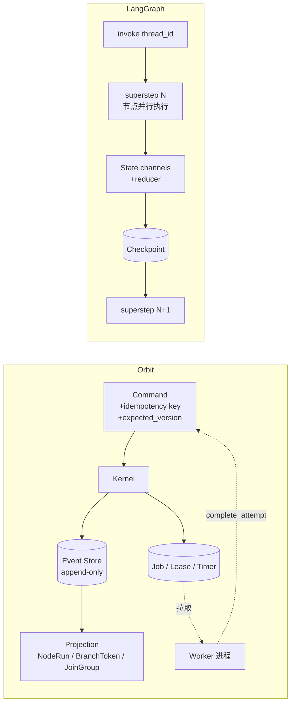

# ADR 002: 不采用 LangGraph 作为 Workflow 基础架构

| 属性 | 值 |
| --- | --- |
| 状态 | Accepted |
| 日期 | 2026-08-11 |
| 关联 | ADR 001 self-built durable kernel |
| 评估对象 | `langchain-ai/langgraph`（MIT，OSS 库；不含 LangSmith Deployment / LangGraph Platform） |

## 决策

不把 LangGraph 作为 Orbit Workflow 层的基础架构。阻断项不是工程量，而是两处语义在 LangGraph 的模型里**无法表达**：分支级 Join 仲裁，和"执行结果未知、禁止自动重跑"的通道。

保留一个开放位置：若将来某个 Handler 内部需要多轮 LLM 工具循环，LangGraph 可以作为**该 Handler 的实现细节**引入，被 `HandlerManifest` 封在 execution boundary 以内。

## 语境

Workflow 层自建约 35k 行，占 `src` 的 80%。这个成本值得定期对着外部方案复核一次。本文记录 2026-08 这次复核的依据，重点是 Join 与恢复语义——图编排的表层能力两边都有，真正的差异在这两处。

> LangGraph 侧的描述基于 1.x OSS 库的公开文档与 API 形态。该项目迭代快，重新评估时应先复核本文的 LangGraph 断言是否仍成立；Orbit 侧的断言全部带文件行号，可直接核对。

## 一、两种执行模型

**Orbit**：图的推进是**命令**，事实是**事件**，节点执行被外包给一个带租约的 durable job，由 worker 拉取。Kernel 本身不执行任何节点。

**LangGraph**：图的推进是 Pregel superstep，节点是进程内函数，状态是带 reducer 的 channel，superstep 边界写一次 checkpoint。驱动图的就是调用 `invoke` 的那个进程。

这一条差异派生出下面全部差异。

## 二、Join 语义对照

### Orbit 的事实

Join 由三个东西共同决定，全部是内容寻址的一等实体：

- **BranchToken** — 一条分支的完成责任。ID 由 `derive_branch_token_id(run_id, plan_version, edge_id, source_generation, activation_key)` 推导（`domain/graph.py:132`），即内容寻址：重复推进图产生同一个 token ID，天然幂等。状态有 5 态：`ACTIVE / COMPLETED / FAILED / CANCELLED / NOT_SELECTED`（`domain/states.py:75`）。
- **JoinGroup** — ID 由 `derive_join_group_id(run_id, plan_version, node_id, generation)` 推导（`domain/graph.py:156`）。`generation` 是关键：rework / loop 的第二轮是**另一个** JoinGroup，不会和上一轮的分支混在一起。
- **`evaluate_join()`** — 纯函数，签名 `(join_group_id, policy, facts, deadline_fired) -> (JoinDecision, merged)`（`graph/joins.py:23`）。第一件事是 `sorted(facts, key=(priority, edge_id))`，因此**与分支到达顺序无关**；不读时钟，`deadline_fired` 是一个事件事实而非墙钟读数，所以 replay 安全（对应 `workflow/README.md` 的 Replay 规则）。

五种 `JoinMode` × 四种 `JoinMergeMode`（`domain/graph.py:45`、`:53`），合并由 `assemble_join_inputs()` 确定性完成（`graph/input_assembly.py:15`）。

`ANY` 与 `N_OF_M` 带**优先级仲裁**：当存在优先级更高、仍处于 `ACTIVE` 的分支时，低优先级的成功不能立即获胜（`graph/joins.py:59-64`、`:73-77`）。这保证了同一组输入下 Join 结果唯一——没有这层仲裁，谁先跑完谁赢，结果依赖调度时序。

### LangGraph 的对应物

fan-in 由"节点的所有触发通道都收到更新"驱动，语义上等价于 `ALL`，且是"全部完成才进下一 superstep"。分支状态被压平进 state channel 的值里——"哪条边没来"这件事在框架层不可观测，除非自己在 state 里维护一份影子记录。

| Orbit JoinMode | LangGraph 原生 | 若要复刻 |
| --- | --- | --- |
| `ALL` | ≈ superstep fan-in | 直接可用 |
| `ALL_SUCCESSFUL` | 无 | 每个分支节点自己 try/except 吞异常并写状态位，否则一条分支失败会让整个 `invoke` 抛出 |
| `ANY` | 无 | 自定义 reducer + 下游守卫；**且落败分支无法取消**，会继续跑完并继续计费 |
| `N_OF_M` | 无 | 同上，优先级仲裁需自己实现 |
| `DEADLINE` | 无 | 库内没有定时器，只能用 `asyncio.wait_for` 包住整个 `invoke`，粒度是整图而非单个 Join |

三个具体缺口：

1. **分支失败不是一等状态。** LangGraph 中一个节点抛异常会让 superstep 失败，进而让整次 `invoke` 失败。"一条分支失败但 Join 按 `ALL_SUCCESSFUL` 继续"需要每个节点自己吞异常。Orbit 里 `FAILED / CANCELLED / NOT_SELECTED` 是 kernel 的一等公民，`evaluate_join` 直接对着它们决策。
2. **没有分支级取消。** `ANY` 一旦选出赢家，其余分支在 Orbit 里被置为 `NOT_SELECTED` 并停止；LangGraph 里它们会跑完。对一个每次执行都要 spawn agent CLI、真实花钱的系统，这不是效率问题而是成本正确性问题。
3. **没有 generation。** LangGraph 循环回到同一节点仍是同一个节点，轮次要塞进 state 自己管；Join 不区分轮次。Orbit 的 `ReworkPolicy` / `LoopPolicy`（`domain/graph.py:276`、`:286`）带 `max_generations` / `max_iterations` 和 `ExhaustionAction`，且每一代有独立的 JoinGroup。

## 三、恢复语义对照

### Orbit 的三层恢复

**第 1 层 · 命令幂等。** `receipts.decide(command)` 命中即返回 `REPLAY_PRIOR_RESULT`，不追加事件（`runtime/kernel_families.py:131`）。同 key 同 fingerprint 返回首次的 event ID，同 key 不同 fingerprint 是 `IDEMPOTENCY_CONFLICT`。Timer 另有一层语义去重：同 `(correlation, purpose, dedupe_key)` 的 `schedule_timer` 返回原 Timer，而不是建第二个（`runtime/durable_kernel.py:122`）。

**第 2 层 · 租约与扫描。** `DurableRecoveryScanner.scan_once()` 每轮做四件事（`runtime/durable_recovery.py:29`）：

1. `expire_lease` — 回收过期的执行租约；
2. `expire_timer_lease` — 回收过期的 Timer 租约；
3. 对 `READY / WAITING` 但没有活跃 Job 的孤儿节点补发 `materialize_job`；
4. 对非终态 Run 发 `advance_graph`。

全部走 `CommandEnvelope`，带 `expected_version` 和确定性 idempotency key（如 `f"materialize:{node_run_id}:{version}"`），因此重复扫描是 no-op。注意 `:58-62`：它按 Run 的**当前** plan version 恢复，而不是 v1——replan 过的 Run 用旧图恢复会路由到已被 patch 删掉的节点。

**第 3 层 · 执行安全等级。** `ExecutionSafety` 两档（`domain/durable_execution.py:30`）：

- `REPLAY_SAFE` — 租约丢失可以重跑。
- `UNKNOWN_ON_LEASE_LOSS` — 租约丢失后 Attempt 进入 `UNKNOWN_EXTERNAL_RESULT` **终态**。`RetryPolicy.__post_init__` 显式拒绝把这个 category 放进重试集合（`domain/graph.py:268`）；迟到的结果只能审计，不能改变状态，继续处理必须创建新 Attempt 或经由 HumanTask（`workflow/README.md` 关键状态决策）。`RecoveryManager` 把它列进 `OPERATOR_OWNED_ELSEWHERE`，明确不代操作员做决定（`recovery/manager.py:21`）。

### LangGraph 的恢复

恢复单位是 `thread_id` + checkpoint。`durability` 参数三档（`exit` / `async` / `sync`）决定写 checkpoint 的时机。崩溃后从最后一个 checkpoint 继续：该 superstep 中已完成节点的写入以 pending writes 形式保存、不会重跑；**正在执行的那个节点从头重跑**。`interrupt()` 恢复时同样是节点从头重放——官方文档因此明确要求把副作用放在 `interrupt()` 之后或自行做幂等。

语义是 at-least-once，幂等责任在节点。节点级 `retry_policy` 存在，但按异常类型分派，不是 Orbit 的 `ErrorCategory` 体系（`workflow/README.md` 错误与失败策略表），也没有 `error` / `timeout` / `cancel` 路由边（`domain/graph.py:33`）。

### 最硬的一条

**LangGraph 没有"结果未知"这个状态。**

Orbit 的 agent handler 正是 `UNKNOWN_ON_LEASE_LOSS` 的典型场景：spawn CLI 子进程、消耗 token、产生真实外部副作用、靠 `ORBIT_RESULT_COMPLETE` 标记判定补全（`handlers/agent.py`）。这个节点崩溃后，唯一诚实的答案是"我不知道它做完了没有，需要人来看"。LangGraph 只会再跑一次。

这条不是工程量问题——在 LangGraph 上补一个"未知结果"终态，等于在它外面重建一套 Attempt 生命周期，也就是重建 Orbit。

## 四、定时器

Orbit 有 8 种 `TimerPurpose`（`domain/durable_execution.py:35`）：`job_backoff`、`node_timeout`、`lease_recovery`、`join_deadline`、`planner_timeout`、`human_reminder`、`human_escalation`、`run_deadline`，均带语义去重。

LangGraph OSS 库没有定时器概念；cron 在 LangSmith Deployment（Platform）一侧，不在 MIT 库里。`DEADLINE` join、node timeout、human escalation 这三类能力在纯 OSS LangGraph 上没有落点。

## 五、结论表

| 维度 | Orbit | LangGraph OSS | 差距性质 |
| --- | --- | --- | --- |
| 幂等边界 | 命令级 receipts | 节点自己负责 | 需重建 |
| 并发控制 | `expected_version` OCC | 无（单进程串行推进） | 需重建 |
| 多 worker | job + lease 领取 | 无（在 Platform） | 需重建 |
| 分支状态 | BranchToken 5 态 + generation | 压平进 state channel | 需重建 |
| Join 策略 | 5 mode × 4 merge + 优先级仲裁 | ≈ ALL | 需重建 |
| 分支取消 | `NOT_SELECTED` 即停 | 落败分支跑完 | **无法表达** |
| 结果未知 | `UNKNOWN_EXTERNAL_RESULT` 终态 | 无此状态 | **无法表达** |
| 失败路由 | success/error/timeout/cancel 四种边 | 异常即整图失败 | 需重建 |
| 定时器 | 8 种 purpose + 语义去重 | 无 | 需重建 |
| 恢复保证 | 命令幂等 + 租约 + 安全等级 | at-least-once 重放 | 语义降级 |
| 工作流表示 | 数据（DSL → 编译校验） | 代码（Python 图） | 与安全模型冲突 |

最后一行值得单独说明：`authoring/generator.py` 的设计前提是"模型的输出没有任何可执行面"——DSL 按名字对着 sealed registry 解析 handler，没有 command 字段可注入。LangGraph 的图是 Python 代码，让 agent 生成图等于让 agent 生成可执行代码，与 `handlers/README.md` 第 3 条（不从 DSL 或 Workflow 输入动态加载模块、URL、Shell 或凭据）正面冲突。

## 六、值得借鉴的（不引入依赖）

1. **Time travel / fork** — 从任意历史 checkpoint 分叉重跑，是 LangGraph 调试体验里最好的一块。Orbit 有完整事件流 + snapshot，素材齐备，缺的只是 API 与 UI。这是当前最值得抄的一条。
2. **durability 分档的思路** — Orbit 目前每条命令都同步落盘。对 `REPLAY_SAFE` 的高频小节点，理论上可以放宽落盘时机。前提是先量化：本地 SQLite 单机场景下这很可能根本不是瓶颈，不要凭直觉优化。
3. **Send API 的动态扇出表达力** — 与 Orbit 的 `foreach` 对照检查一遍表达力缺口（如运行期决定的扇出宽度、每个分支携带不同 payload）。

## 七、复核触发条件

出现下列任一情况时重新打开这个决策：

- Orbit 需要跨机分布式执行 —— 那时该评估的是 Temporal / Restate 这类 durable execution 引擎，不是 LangGraph；本文的对照维度可直接复用。
- 某个 Handler 内部需要多轮 LLM 工具调用循环，且不再走 CLI 子进程 —— 那时 LangGraph 作为该 Handler 的内部实现是合理的，不触及本 ADR 的结论。

## 参考

| 断言 | 位置 |
| --- | --- |
| 命令幂等 / receipts / 拒绝码 | `src/orbit/workflow/runtime/kernel_families.py:117` |
| Timer 语义去重 | `src/orbit/workflow/runtime/durable_kernel.py:122` |
| Join 决策纯函数 | `src/orbit/workflow/graph/joins.py:23` |
| Join 输入合并 | `src/orbit/workflow/graph/input_assembly.py:15` |
| 边路由与优先级 | `src/orbit/workflow/graph/routing.py:17` |
| 条件 AST（受限、无 eval） | `src/orbit/workflow/graph/conditions.py:95` |
| 完成判定 | `src/orbit/workflow/graph/completion.py:20` |
| BranchToken / JoinGroup ID 推导 | `src/orbit/workflow/domain/graph.py:132`、`:156` |
| JoinMode / MergeMode / 策略 | `src/orbit/workflow/domain/graph.py:45`、`:53`、`:296` |
| RetryPolicy 拒绝 unknown | `src/orbit/workflow/domain/graph.py:268` |
| ExecutionSafety / TimerPurpose | `src/orbit/workflow/domain/durable_execution.py:30`、`:35` |
| 状态枚举 | `src/orbit/workflow/domain/states.py` |
| 崩溃恢复扫描 | `src/orbit/workflow/runtime/durable_recovery.py:29` |
| 运维恢复与人工归属 | `src/orbit/workflow/recovery/manager.py:21` |
| Agent handler 外部副作用 | `src/orbit/workflow/handlers/agent.py` |
| DSL 生成的安全前提 | `src/orbit/workflow/authoring/generator.py` 模块 docstring |
| Handler 注册纪律 | `src/orbit/workflow/handlers/README.md` |
| 错误 Category / Replay 规则 | `src/orbit/workflow/README.md` |
