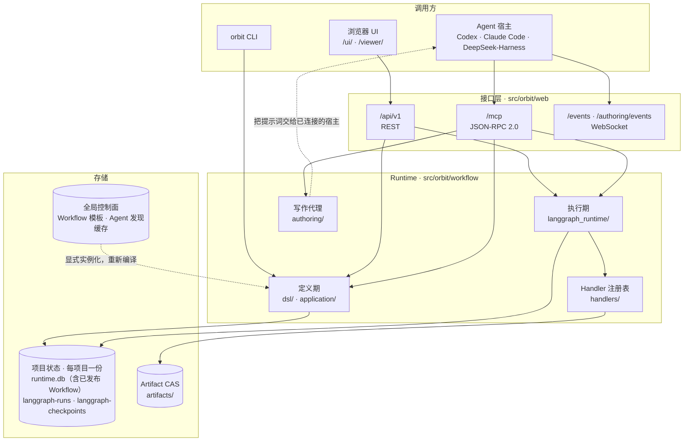
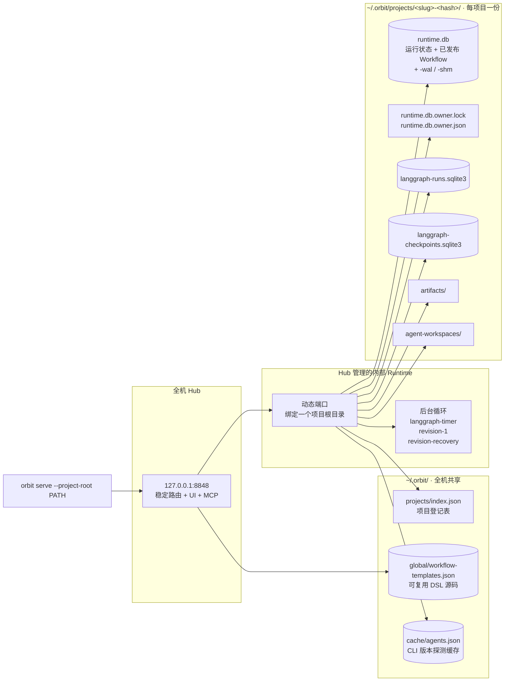
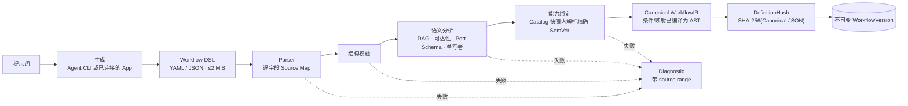
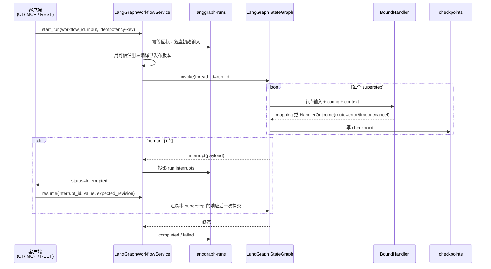
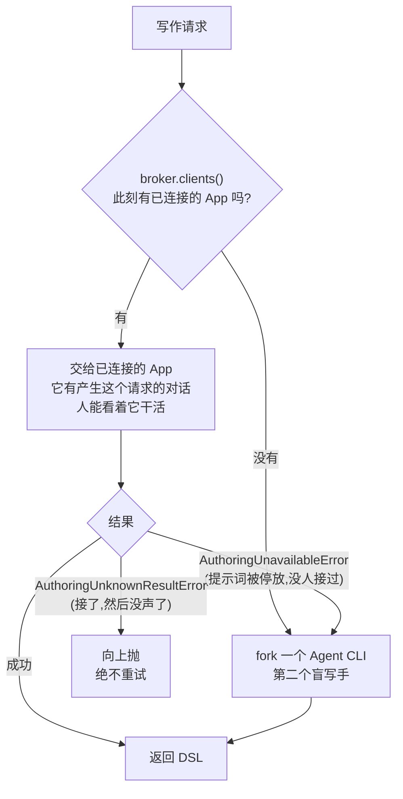
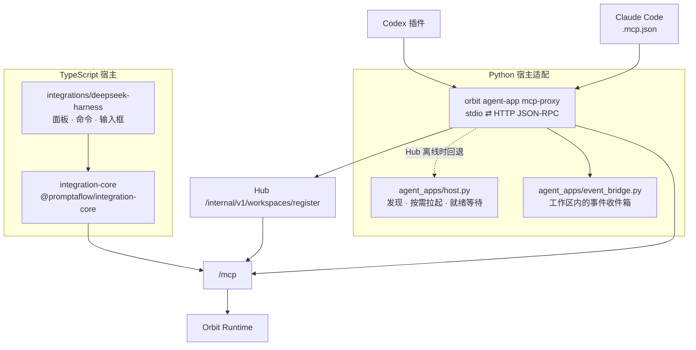

# Orbit 架构

> 三部曲之一。另两篇:[generating-a-workflow.md](./generating-a-workflow.md)(一句话怎么变成 Workflow)、
> [executing-a-goal.md](./executing-a-goal.md)(一个 Goal 怎么跑完)。
>
> 本文描述仓库当前**实际**的结构,不是路线图。每条结论都对照了代码或运行中的 Runtime;
> 与既有文档不一致的地方在 [§13](#13-结构性缺口) 单独列出,没有就地掩盖。

---

## 1. 一句话

Orbit 是一个**本地**的、单人使用的 Agent 工作流 Runtime:Agent 写出静态的 Workflow DSL,
可信编译器把它编译成 LangGraph 图,每个可执行节点交给**已注册的** Handler 运行,
全过程持久化、可恢复、可重放。

关键在于「Agent 不产生可执行代码」——它产生的是**数据**,能不能执行由编译器说了算。

## 2. 六条约束

这六条解释了后面几乎所有的设计。它们不是建议,是代码里 fail-closed 的规则。

| # | 约束 | 落在哪里 |
|---|---|---|
| 1 | **Agent 只产出 DSL,不产出可执行 Python。** 每个可执行 IR 节点必须解析到精确 `name + version + manifest 指纹` 的 `BoundHandler`,否则编译失败。(Agent 步骤在编译前多一层 `AgentFallback`,但它**只按名字**判断搬不搬。) | `workflow/langgraph_runtime/compiler.py` |
| 2 | **命令由服务端签发。** 客户端只能执行响应里 `allowed_commands[]` 给出的命令,不得自己拼 URL。服务端是「谁能做什么」的唯一权威。 | `web/api_v1/common.py`、`AGENTS.md` |
| 3 | **写操作必带 `idempotency-key` 与 `expected_version`。** 同 Key 同语义重放首次结果;同 Key 不同语义直接判冲突。 | `workflow/persistence/`、`langgraph_runtime/service.py` |
| 4 | **未知外部结果是终态。** Attempt 超时、取消、进程丢失、恢复时发现 `started`,一律停在 `unknown`,**永不自动重投**。迟到的结果只能审计。 | `langgraph_runtime/service.py` |
| 5 | **发布即不可变。** `WorkflowVersion` 由数据库 Trigger 禁止 UPDATE/DELETE;`DefinitionHash` 是 Canonical JSON 的 SHA-256。 | `workflow/persistence/workflow_versions.py` |
| 6 | **一个项目一个 Runtime。** 由文件锁 + 已发布的 `runtime.json` 保证,第二个 `serve` 直接拒绝启动。 | `platform/runtime_ownership.py` |

## 3. 系统全景



注意最后那条虚线:**写作是反向的**。Runtime 会把「写一个 Workflow」这件事,
优先交给一个**已经连着它的** Agent App,而不是自己 fork 一个 CLI。见 [§7](#7-写作回环谁来写这个-workflow)。

## 4. 进程、端口与状态

`orbit serve` 是统一入口：先复用或启动全机唯一的 Hub，再注册当前项目，并由 Hub
启动内部 Runtime 进程。用户不再直接启动单 Workspace Runtime：



**持久化边界:**

| 文件 | 内容 | 作用域 |
|---|---|---|
| `~/.orbit/global/workflow-templates.json` | 可复用 Workflow DSL 源码，不是可执行版本 | **全机唯一** |
| `~/.orbit/cache/agents.json` | 受信 CLI 路径/文件身份/版本的短期探测缓存 | **全机唯一** |
| `runtime.db` | 项目运行时状态、草稿、写作任务、已发布 `WorkflowVersion` | 每项目 |
| `langgraph-runs.sqlite3` | Run 元数据、幂等回执、耐久定时器 | 每项目 |
| `langgraph-checkpoints.sqlite3` | LangGraph checkpoint | 每项目 |

已发布 Workflow 与 Handler 精确版本/指纹绑定，因此必须属于验证它的 Workspace
Runtime。跨 Workspace 复用的是**源码模板**；Hub 把模板实例化到目标 Workspace 时，
仍由目标 Runtime 重新编译、校验 Handler 并发布不可变版本。Agent CLI 安装发现可共用
短期缓存，但每个 Runtime 都会重新解析 PATH 和文件身份，并独立注册/授权 Handler。
Agent 原始执行统计仍属于 Workspace；Hub 的 `/api/v1/global/agent-stats` 只聚合已在线
Runtime，不会为了查统计而启动离线 Workspace。
首次启动 Hub 会把旧 `~/.orbit/workflows/library.db` 和
`single-agent-library.db` 中仍保留作者源码的最新版本幂等导入为全局模板；
旧库保持只读、不删除，也不会自动发布到任何 Workspace。Workspace 旧 Run
已引用的精确版本会单独恢复到该 Workspace 并标记归档，因此可继续读取/恢复，
但不会因迁移而重新变成可新建 Run 的工作流。模板目录的修改由 OS 文件锁串行化；
任何读取或 JSON 校验失败都会 fail closed，不会把损坏目录当成空目录覆盖。

**归属与发现:** `runtime.db.owner.lock` 是文件锁,相邻的
`runtime.db.owner.json` 记录 `base_url`,
外部客户端(如 stdio 代理)靠它找到已经在跑的 Runtime,而不是猜端口。

## 5. 定义期:从提示词到不可变版本

> 这条链上每一步**具体是什么类型**——模型产出什么、入库的是什么、执行时又是什么——
> 见 [generating-a-workflow.md §7「一份数据的五次变身」](./generating-a-workflow.md#7-一份数据的五次变身)。

### 先说清楚:DSL 和 IR 分别是什么

这两个词贯穿全文,先定义一次。

**DSL(Workflow DSL,领域专用语言)** —— 一份 YAML 或 JSON 文档,**写给作者看的**。
作者可能是人,也可能是 Agent。它允许省略、允许简写、允许写版本约束,
目的是**好写好读**。Runtime **从不读它**。

**IR(Canonical WorkflowIR,规范中间表示)** —— 由编译器从 DSL 产出,**写给机器的**。
默认值全部补齐、简写全部展开、键按字典序排、条件和映射变成 AST、
Handler 版本解析成精确的一个、外加一份预算好的邻接索引。**它是唯一的执行真相。**

用一句熟悉的类比:**DSL 之于 IR,约等于源码之于字节码**。而 `source_text` 之所以还留着,
理由和仓库里为什么要留源码一样——给人读、给下次改写当基底。

| | DSL | Canonical IR |
|---|---|---|
| 给谁看 | 人、Agent | 编译器、Runtime |
| 格式 | YAML 或 JSON,随便排 | 规范化 JSON,键按字典序 |
| 能省略吗 | 能(条件、映射、priority…) | 不能,一律补齐 |
| Handler 版本 | 可以是约束 `^1.2` | **只能精确** `1.2.3`,否则构造就报错 |
| 条件怎么写 | 可以是字符串表达式(Python 白名单子集) | **只能是已编译的 AST** |
| 谁来执行 | **没人** | Runtime |
| 存在哪一列 | `source_text`(**可以为空**) | `canonical_ir_json`(**NOT NULL**) |
| 进 Definition Hash 吗 | 否 | **是** |

### 为什么非要分成两个

不是为了好看。四条都是**分开之后才成立的**能力:

**① 好写的格式和好执行的格式,要求是相反的。**
作者要省略(「这条边没有条件」),执行要确定(「这条边的条件是 `{"op":"literal","value":true}`」)。
一种格式同时满足两边,只能靠执行期去猜省略的部分——而猜测没有版本,也没法 Hash。

**② 有了 IR,Hash 才认语义而不认排版。**
同一份逻辑,YAML 写还是 JSON 写、字段先后、有没有注释——DSL 文本完全不同,IR 完全相同,
所以 `definition_hash` 一样。反过来,升级一个 Agent CLI 会改变 IR 里的精确版本和指纹,
Hash 就变——**该变的时候变,不该变的时候不变**。

**③ 有了 IR,信任边界才画得出来。**
Agent 写的 DSL 是**提议**;编译器产出的 IR 是**已核准**。校验只在这一个转换点做一次,
执行期不必再怀疑手上这份东西——它已经不可能是模型随口写的了。

**④ 有了 IR,执行期不需要解释器。**
条件在 DSL 里可以是一小段表达式文本,进 IR 就成了 AST。所以 Runtime **不绑 Python `eval`**,
执行期只做求值,不做解析。

### 一眼看懂的例子

作者写的一条边(DSL),3 个字段:

```json
{ "id": "deliver", "from": {"node": "a", "port": "result"},
                   "to":   {"node": "b", "port": "result"} }
```

编译出来的同一条边(IR),11 个字段——省略的全被补上,`from`/`to` 被拍平,键排了序:

```json
{ "back_edge": false,
  "condition": {"op": "literal", "value": true},
  "id": "deliver",
  "mapping": {"op": "identity", "schema_id": "schema://object/1.0"},
  "policy_ref": null, "priority": 0, "route": "success",
  "source_node": "a", "source_port": "result",
  "target_node": "b", "target_port": "result" }
```

> 完整的、取自真实数据库的逐阶段对照,见
> [generating-a-workflow.md §7](./generating-a-workflow.md#7-一份数据的五次变身)。

### 定义期管线



要点:

- **每一级只消费上一级的成功结果**;Parser / Validator / Compiler 都不碰数据库、时钟、随机数、网络、Handler 实现。
- **Runtime 只读已发布的 Canonical IR**,不重新解释 DSL 文本、表达式或默认值。
- 字符串条件用的是 Python 表达式的**白名单子集**,且**只在编译期存在**——Runtime 执行的是 IR 里已校验的 AST,不绑定 `eval`。UI 直接提交结构化 AST,不生成 Python 文本。
- 内容幂等优先于乐观并发:同 Hash 重复发布直接返回既有版本,即使带着过期的 `expected_latest_version`。

## 6. 执行期:LangGraph 是唯一引擎

`LangGraphWorkflowService`(`langgraph_runtime/service.py`,2414 行)是 Orbit **唯一**的执行引擎。
不兼容的定义**不可运行,也不回退到其他引擎**。



**支持的契约面**(刻意小于旧 Runtime,不支持的声明在**创建 Run 之前**就报错,绝不静默忽略):

| 面 | 支持 |
|---|---|
| 节点类型 | `action` · `decision` · `human` · `join` · `terminal` |
| 路由 | success / error / timeout / cancel、条件、互斥与并行扇出 |
| Join 策略 | `all` · `all_successful` · `any` · `n_of_m` · `deadline` |
| 重复 | 有界 `loop` / `rework`,耗尽时 `fail` 或 `error_route` |
| 耐久 | SQLite checkpoint、重试定时器、Join 截止、恢复、取消 |

明确**不支持**:`agentic` / `foreach` / `subflow` / `extension` 节点,以及顶层 IR extension。
运行中的 Runtime 也这么报告(`foreach` 与 `subflow` → `not_supported_by_engine`)。

**几个容易看漏的语义:**

- **无 Handler 的 `human` 节点直接编译成原生 LangGraph interrupt**,payload 含 workflow / node / 声明输入 / config。
- **定时器状态机是 `scheduled → firing → fired`**,「认领定时器」与「推进 run revision」在**同一个 SQLite 事务**里。进程在认领后、checkpoint 推进前死掉,下一个进程看到 `firing` 并幂等收尾。
- **取消是「拒绝开始」,不是「承诺停止」。** 取消先落盘再跑 Handler 的取消钩子,所以迟到的结果**不能覆盖 `cancelled`**。
- **`/steps` 和 `/edges` 都是推导出来的**(定义 + checkpoint),不是记录下来的;它们只说节点和边,不带流过的数据,所以是普通读权限。`/output` 是 Handler 打印的东西,因此归 `runtime.read.sensitive`。
- **「这条分支从没走过」需要统计,不是单次运行能回答的**,所以由 `GET /api/v1/workflows/{id}/branches` 在某一个定义版本的所有 run 上重算,而不是维护计数器——删 run 就该让证据变少,而不是留下一个「40 次」挂在 5 条幸存记录后面。

## 7. 写作回环:谁来写这个 Workflow

这是 Orbit 里最不直观、也最值得单独画的一段。「生成一个 Workflow」有两种写手:



为什么 `Unknown` 不重试:那个 App 可能**已经付过一次模型调用的钱**了。重试它就是把一次请求变成两份账单——
这个代码库在所有能避免的地方都拒绝这件事。而 `Unavailable` 明确表示「停放了,而且没交给任何人」,
什么都没花掉,所以 fork 是**第一次**尝试而不是第二次。

判断发生在**写提示词的那一刻**,不是 Runtime 启动时:写作是被请求之后几分钟才跑的活,
而客户端一直在来来去去(`web/app.py::_connected_client_first`)。

写手名字的优先级(高 → 低):**运营方显式配置的 structured agent** → **发现到的 Agent CLI** → **已连接的 App**。
App 永远盖不住 CLI,重名直接拒绝——两个写手答应同一个名字,就没法如实告诉作者是谁写的,
而**告诉错了比报错更糟**。

## 8. 接口层

三个面,同一套身份与授权。

| 面 | 协议 | 用途 |
|---|---|---|
| `/api/v1` | HTTP REST | 读走 cursor 分页;写必须带 `idempotency-key` 头与 `expected_version` |
| `/mcp` | JSON-RPC 2.0 over HTTP | Agent 工具面,`initialize` / `tools/list` / `tools/call` |
| `/events` | WebSocket | Runtime 事件**元数据** + 不透明 cursor;订阅者收到后**重新去读** HTTP/MCP 资源再行动 |
| `/authoring/events` | WebSocket | 写作请求的推送侧 |
| `/ui/` `/viewer/` | 静态 | 见 [§11](#11-前端) |

`/events` 只送元数据这一点是有意的:授权和 `allowed_commands` 留在已经拥有它们的应用服务里,
socket 不成为第二个权威。

**MCP 有两档工具面**(`web/mcp.py::MCP_TOOL_PROFILES`):

| 档 | 行为 |
|---|---|
| `full`(默认) | 暴露组合根装配出的全部工具。实测本机为 **29** 个 |
| `harness` | 按 `HARNESS_TOOL_NAMES`(31 个名字)过滤。它是**白名单**,实际出现哪些仍取决于组合根装了什么 |

`harness` 档同时会打开 actor 作用域(见下节)。两者是**耦合**的,不能只开一个。

## 9. 身份、作用域与授权

```
LOCAL_ACTOR   = "local"
LOCAL_SCOPES  = runtime.read · runtime.write · runtime.read.sensitive
              · runtime.ops.read · runtime.ops.write
```

| 档 | 认证器 | `x-orbit-actor` 头 | 结果 |
|---|---|---|---|
| `full` | `loopback_authenticator` | **忽略** | 环回上的任何调用方都是 `local`,拿全部 scope |
| `harness` | `loopback_scoped_mcp_authenticator(trusted_prefix="harness:session:")` | **必须**以该前缀开头 | 不匹配 → 认证返回 `None` → 请求被拒(`-32001`) |

这是一个真实的**可移植性边界**:一个不带 `harness:session:` 前缀的宿主(比如 Claude Code)
在 `harness` 档下会被拒掉每一次工具调用。要给别的宿主一个身份,需要 Orbit 侧新增受信前缀,
不是客户端改个字符串就行的。

## 10. 集成层:一个 Runtime,多个宿主



**`integration-core`** 的归属规则是**机械可判定**的,不靠品味:
*一个模块属于这里,当且仅当它不 import 任何宿主 SDK、不碰 DOM。*
12 个模块:`gateway` `codecs` `types` `error-text` `orbit-model` `run-progress`
`workflow-catalog` `authoring-claim` `authoring-progress` `artifact-export` `session-bridge` `commands`。

其中 `error-text.ts` 的分工值得一提:**词汇表在 core,措辞在宿主**。
`ORBIT_ERROR_KEYS` 是「能出什么错」的集合;而「重新打开面板以启动」这句话
不是一个后台进程说得出口的,所以措辞留给宿主。

**`orbit agent-app mcp-proxy`** 是 Python 侧的等价物:把 HTTP JSON-RPC 的 MCP 端点
用换行分隔的 JSON-RPC 抬到 stdio 上,顺带注入三个事件工具
(`wait_app_event` / `list_app_events` / `ack_app_event`)。
它由 `agent-app.json` 清单驱动:`service.command` 说怎么起、`ready_url` 说怎么算就绪、
`discovery: "orbit-runtime"` 说怎么找到已经在跑的那一个。

工作区注册由常驻 Hub 独占写入。代理把绝对路径发给 Hub 的内部环回端点，拿回
workspace-scoped MCP/UI/events URL；它不直接改 `~/.orbit/hub/workspaces.json`。
Hub 已就绪时代理也不会进入 `AgentAppHost` 的用户级锁目录。事件收件箱默认放在
工作区 `.orbit/agent-apps/<app-id>/`，因此受限宿主只需对当前工作区有写权限；显式设置
`AGENT_APP_STATE_DIR` 或 `--state-dir` 时仍尊重调用方指定的位置。只有 Hub 确实离线时，
代理才回退到 `AgentAppHost`，以保留没有独立服务管理器的宿主原有的自启动能力。

> `integrations/claude-app` 目录现在**只剩 `node_modules`**,源码已删除、git 也不跟踪它。
> 它是一次被撤销的重复实现——那三项增强已并入上面的 Python 代理。可以直接 `rm -rf`。

## 11. 前端

两个独立前端,**不共享设计令牌**:

| | 技术 | 路径 | 暗色画布 |
|---|---|---|---|
| Runtime UI | 手写 ES 模块 + CSS,无构建步骤 | `src/orbit/static/workflow-ui/` | `#181818`(6 个 token 共用一张画布) |
| 图编辑器 | Vite + React Flow,构建产物 | 源 `ui/editor/` → 产物 `src/orbit/static/workflow-editor/` | `#0f1115`,**自成一套** |

编辑器嵌在页面里,由宿主页面 `postMessage` 告知主题;它单独打开时才跟随系统偏好。
两套暗色底色并不一致,这是既有状态,不是本次引入的。

## 12. 后台循环与恢复

`RuntimeComposition` 按**装了什么**决定起哪些循环——不是无条件起一组:

| 循环 | 条件 | 职责 |
|---|---|---|
| `langgraph-timer` | 服务实现了 `recover_due` | 驱动到期的耐久定时器。这是唯一没有调用方能推动的一段:run 已挂起,没有人还在等它 |
| `run-retention` | 显式配置了保留天数 | 删过期 run。**默认关闭**——run 是某人设下的目标,因为一个默认值就删掉他的历史,比让他在 Ops 页看到数据库变大更糟 |
| `revision-1` | 装了 reviser | 花模型调用改写草稿 |
| `revision-recovery` | 同上 | 把 worker 中途死掉的任务判失败 |

就绪检查要求**存在的每个循环都活着**,而不是「至少有一个」:一个只做写作的 Runtime
后台本来就没东西可驱动,空列表曾经只可能意味着循环全死了,现在不再是。

## 13. 结构性缺口

按「能不能靠代码自证」分类,不含主观改进建议。

**引用了但不存在的文件**

| 引用方 | 目标 | 状态 |
|---|---|---|
| `AGENTS.md` | `./CLAUDE.md` | 不存在 |
| `src/orbit/workflow/README.md` | `docs/adr/001-self-built-durable-kernel.md` | 不存在 |

**空目录**(只有 `__pycache__`,无 `.py`)

`workflow/` 下:`capacity` `planner` `policy` `recovery` `runtime` `security` `testing` `worker`。
它们对应 `workflow/README.md` 里列为「不在当前基线内」的步骤(Planner、Policy、Budget 等)。
该 README 描述的是**领域契约**基线,与实际执行路径(LangGraph)不是同一层——读的时候要分清。

---

## 附:本文的证据来源

- 代码:`src/orbit/{web,workflow,platform,agent_apps}`、`integration-core/src`、`integrations/`
- 各包自带 README:`workflow/`、`workflow/dsl/`、`workflow/handlers/`、`workflow/persistence/`、`workflow/langgraph_runtime/`、`integration-core/`
- **运行中的 Runtime**:`GET /api/v1/capabilities`、`GET /health/ready`、MCP `tools/list` 与 `get_capabilities`(工具计数、引擎能力、已发现的 11 个 Agent CLI 均来自实测,非推断)
- 磁盘:`~/.orbit/projects/<slug>/`、`~/.orbit/workflows/`
