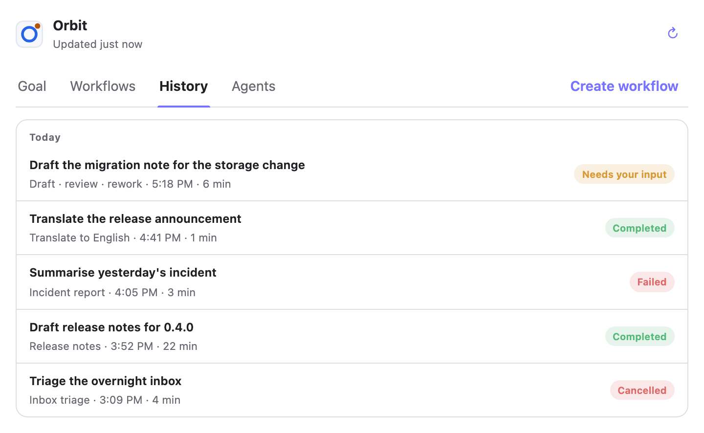
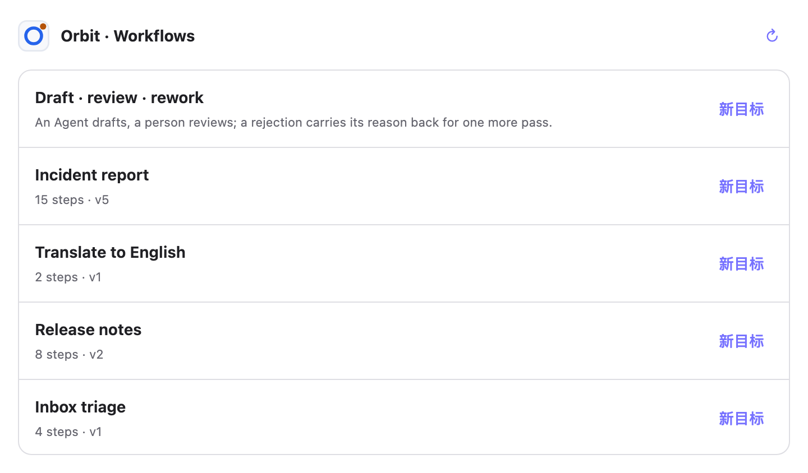
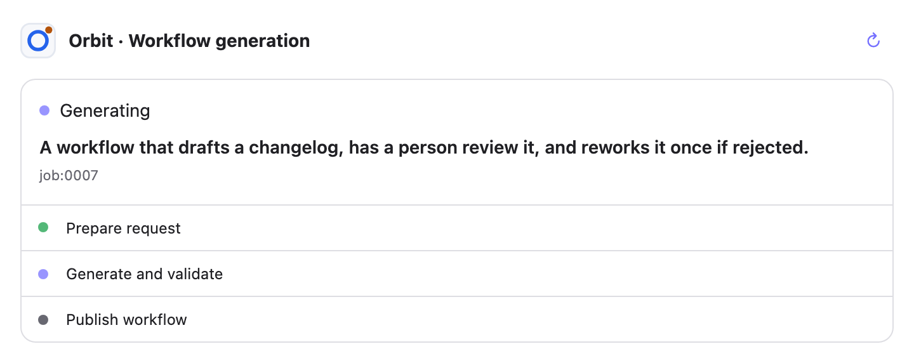
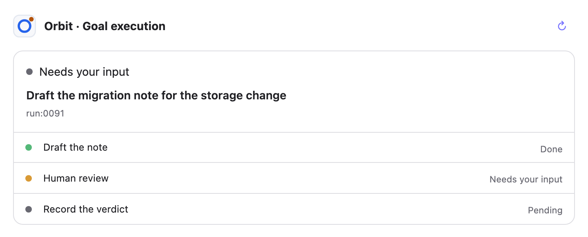
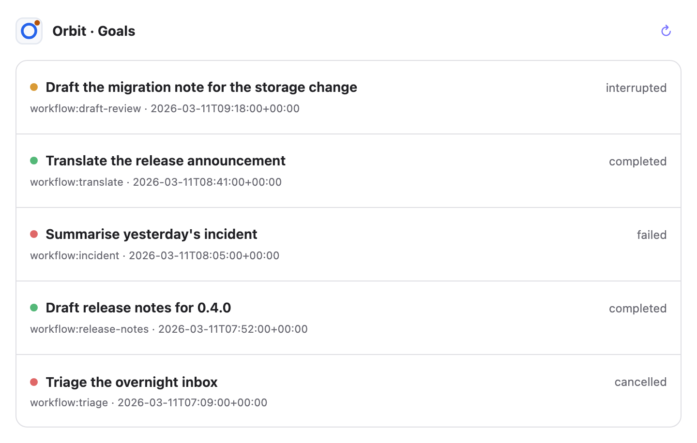

# 卡片

**简体中文** | [English](./cards.md) · [宿主](./hosts/README.zh-CN.md) · [Orbit](../README.zh-CN.md)

Orbit 附带五张小页面，宿主可以把它们画在对话旁边。它们是 MCP App（MCP Apps 扩展，
SEP-1865）：每一张都作为 MCP 资源发布、mime type 为 `text/html;profile=mcp-app`，
并通过 `_meta.ui.resourceUri` 绑定到打开它的那个工具上。

## 怎么打开一张卡片

**调用那个工具就行。** 没有单独的「打开卡片」调用 —— 卡片就在工具的 `_meta` 里，
所以实现了 MCP Apps 的宿主会在工具应答时把它挂进沙箱 iframe，没实现的则只显示工具
返回的 JSON。**画不画是宿主的决定，不是 Orbit 的**，所以「调用成功了吗」和「屏幕上
出现了吗」要当成两个问题看。

| 调用这个 | 就出现这张卡 | 显示 |
| --- | --- | --- |
| `open_orbit_dashboard` | Orbit dashboard | 整个工作区：工作流、历史记录、Agents |
| `list_workflows` | Orbit workflows | 已发布的目录 |
| `get_workflow_definition` | Orbit workflows | 同一张卡，直接停在某个工作流上 |
| `generate_workflow` | Orbit workflow generation | 某个撰写任务的进度与结果 |
| `start_run` | Orbit goal execution | 该次 run 的步骤、是否需要人、以及结果 |
| `open_orbit_goals` | Orbit goals | 最近的目标运行及其状态 |

**按意图选卡，不要先开 dashboard**：要看工作流就是 `list_workflows`，要跑目标就是
`start_run`；「打开 Orbit」本身才是 `open_orbit_dashboard`。

## 每张卡是什么



**Orbit dashboard。** 四个 tab —— 目标、工作流、历史记录、Agents —— 行尾是**创建工作流**。

**目标**是卡片打开时落到的那一页：正在跑的全部，或者都不在跑时最近跑过的那一个，
带上它的步骤、还能对它做的事、以及它的结果。一个目标跑完的那一刻，正是它的结果最要紧
的时候，所以**跑完的目标会一直占着这一页**，直到下一个开始 —— 而不是当场消失、把
「发生了什么」回答成一张空页。从来没跑过任何东西时，这一页会直说。

**历史记录**是同一个项目的全部目标执行记录，按天分组；打开一条看到的，就是目标页对
单个 run 显示的那些东西。



**Orbit workflows。** 已发布的目录，每行带**新目标**。点某一行会把**同一张卡**切换到
该工作流的详情（流程图、定义列表，以及新目标／修改／删除），而不是再开一张卡。



**Orbit workflow generation。** 一个撰写任务：排队中、生成中、已生成或失败，并带上
当初给它的要求。



**Orbit goal execution。** 一次 run：它的步骤、是否需要人、以及结果。



**Orbit goals。** 最近的 run 及其当前状态，列表形式。

**五张卡都跟随宿主的语言** —— 按钮、空状态，以及它们送回对话的提示词都跟随。宿主报了
语言就用宿主的，没报之前用浏览器的猜；宿主中途改语言，卡片会重画。

（上面的截图是英文的，因为生成脚本用 `en-US` 拍。）

## 卡片是视图，不是权限

卡片上的操作**把意图送回对话**，它自己不改 Runtime。有人点「批准」时，卡片是请 Agent
去提交已声明的输出对象 —— 而 Agent 必须重新读取这次 run、使用它当前的 `interrupt_id`、
`revision` 和 `allowed_commands[]`，并且绝不自行拼接写操作 URL。目录、历史、流程图、
日志和工作流管理归 `/ui` 那个完整浏览器 UI；卡片只显示此刻要紧的那件事。

## 为什么卡片有时看起来是旧的

**宿主按 URI 缓存 MCP App 资源。** 每张卡的 URI 都带版本 ——
`ui://orbit/current-task-v45.html`、`ui://orbit/workflows-v22.html` —— 改动一张卡就
意味着换一个新 URI 发布，因为已经取过旧 URI 的宿主会一直渲染那份旧文档。

对使用者的影响很小但真实：**升级 Orbit 之后，开一个新对话。** 已经挂载过卡片的会话
会继续用它当初取到的那一份。

## 怎么重新生成这些图

```bash
.venv/bin/python scripts/screenshot-cards.py
```

截图由脚本里的**固定数据**驱动，而不是由运行中的 Runtime，有两个原因：真实目录的截图会
把操作者当时在做的东西带进仓库；而实时数据的截图每次都不一样，于是「重新生成后的图片
diff」说明不了卡片到底改没改。时钟也钉死了，所以「刚刚更新」和「今天」在每台机器上是
同一个意思。

每张图在拍之前会按卡片**实际装了多少内容**重新调整取景 —— 上限就是卡片自己的上限，
所以比卡片更长的列表仍然被拍成「一个会滚动的列表」。
