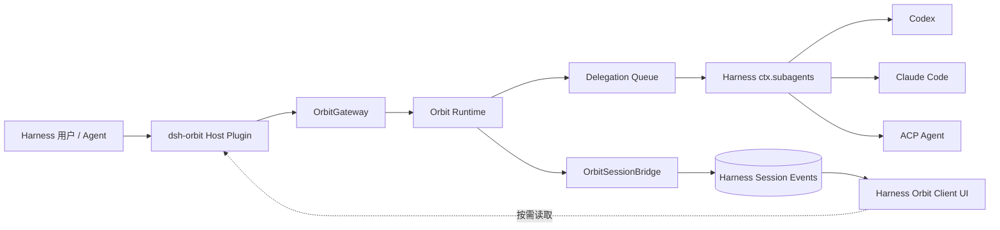

# Orbit × DeepSeek Harness 深度集成计划

| 属性 | 值 |
| --- | --- |
| 状态 | Draft |
| 日期 | 2026-08-21 |
| Orbit 范围 | Runtime、MCP/HTTP、事件、Workflow UI、Agent Handler |
| Harness 基线 | `deepseek-ai/deepseek-harness@b150a551b8d465e31e418e1b2eaf5e79bbb7d28e`（`0.1.1-rc.2`） |
| 首要目标 | 让 Orbit 成为 Harness 中可安装、可编排、可观察、可操作的一等 Workflow 能力 |

## 1. 背景与结论

Orbit 已具备 durable Workflow、静态 DSL、版本化 Run、节点级输出、Artifact、人工中断、恢复、HTTP/MCP 和 Web UI。DeepSeek Harness 已具备可安装 Bundle、MCP Client、Subagent Provider、持久 Session Event、动态 Web Client Module、Conversation Node、Settings Card 与 Job 控制面。

二者不应互相替代：

- Orbit 负责 Workflow 定义、DAG 推进、节点状态、幂等、重试、恢复和 Artifact 归属。
- Harness 负责会话、Agent Provider、CLI/SDK 子进程、Workspace、凭据、权限策略和用户交互。
- Harness Session Event 保存可回放的 Run 摘要；Orbit 始终是 Run 详情和命令权限的事实源。
- UI 采用 Harness 原生 Client Plugin；iframe 只保留为过渡期的“在 Orbit 中打开”入口。

目标调用链：



## 2. 目标

### 2.1 产品目标

1. Harness Agent 可以通过稳定工具启动、查询和控制 Orbit Run。
2. Orbit Run 在 Harness 对话中显示为可回放、实时更新的原生 Run Card。
3. 用户可在右侧详情页查看 Run、步骤、每步指令与输出、执行图、分支和 Artifact。
4. Orbit interrupt 可以在 Harness 会话中请求用户输入并恢复 Run。
5. Orbit 的 Agent 节点可以安全委派给 Harness 已注册的 Codex、Claude Code 或 ACP Provider。
6. 多 Workspace、重启、断线、重复请求和并发执行下不产生重复 Agent Job。

### 2.2 工程目标

- 保持 Orbit HTTP/MCP 向后兼容。
- 所有写操作继续使用服务端 `allowed_commands[]`、`expected_version` 和幂等键。
- 日志、Artifact 内容和完整 Graph 不进入 Harness Session Event。
- 外部 Agent CLI 的凭据、版本、进程与权限策略只由 Harness 管理。
- 每个长期状态都可在 Host 或 Runtime 重启后重新协调。

### 2.3 非目标

- 不用 Harness 的临时 JS Workflow 替换 Orbit durable Workflow。
- 不让 Orbit DSL 拼接任意 CLI 命令、环境变量或 Harness URL。
- 首版不实现 Codex/Claude Code 原生会话续接、推理过程镜像或交互式 CLI 权限转发。
- 不自动把全部 Orbit Artifact 复制为 Harness Attachment；只在用户显式导入时复制。
- 不在首版原生重写 Orbit Workflow 编辑器和全部运维页面。

## 3. 总体架构

### 3.1 插件内部边界

首版可以发布为一个 Bundle，但代码按三个组件拆分：

```text
integrations/deepseek-harness/
├── package.json
├── cordis.patch.yml
├── src/
│   ├── index.ts
│   ├── host/
│   │   ├── orbit-gateway.ts
│   │   ├── orbit-client.ts
│   │   ├── runtime-supervisor.ts
│   │   ├── session-bridge.ts
│   │   ├── delegation-executor.ts
│   │   └── remote.ts
│   └── client/
│       ├── index.ts
│       ├── run-node.tsx
│       ├── run-detail-drawer.tsx
│       ├── step-output.tsx
│       ├── graph-view.tsx
│       ├── artifact-view.tsx
│       └── settings-card.tsx
└── tests/
```

后续允许拆成：

- `dsh-orbit`：Runtime 生命周期、Session Bridge、Remote API。
- `dsh-subagent-orbit-executor`：执行租约、委派队列、`ctx.subagents` Adapter。
- `dsh-client-ui-orbit`：Conversation Node、详情 Drawer、Settings 和 Dashboard。

### 3.2 OrbitGateway

`OrbitGateway` 是 Harness 与 Orbit 的唯一 Host 边界：

- 根据 Harness Session 的 Workspace Reference 解析 Orbit Project。
- 每个规范化 Workspace 最多管理一个 Orbit Runtime。
- 支持自动启动本地 Runtime或连接外部 Runtime。
- 负责 readiness、版本握手、MCP/HTTP Client、认证和进程回收。
- 多个 Agent/Session 通过引用计数共享同一 Workspace Runtime。
- 新增数据库级 Runtime ownership：对规范化数据库路径建立跨进程所有权锁、实例身份和 stale-owner 接管规则。Gateway 进程内引用计数不等于该保证；第二个 Harness 实例或用户手工执行 `orbit serve` 也必须经过同一约束。
- 浏览器客户端不得直接访问 `127.0.0.1:8848`，统一经过 Host Remote API。

Orbit 当前 `create_app()` 默认启用 `single_goal_mode`，并按 `owner_actor` 拒绝同一 actor 的第二个活跃 Run。Harness 接入不能使用与 Orbit UI 共用的 Workspace actor。Host Gateway 通过受信任 stdio metadata 为每个 Session 使用 `harness:session:*` actor；Execution Lease 阶段再升级为 Lease-scoped actor。其他备选方案保留如下：

- 为每个 Harness Session 或 Execution Lease 签发独立 scoped actor；或
- 为 Harness 管理的 Runtime 显式关闭 `single_goal_mode`，由 Harness Lease/预算控制并发；或
- 改造 Orbit，将 single-goal slot 从 actor 身份中分离为显式 scope。

Session-scoped actor 仍会串行同一 Session 中的多个 Run；若产品要求同一 Session 并发，优先选择 Lease-scoped actor，而不全局关闭 single-goal。身份方案必须同时定义 Run 读取、Session Bridge 和人工操作的授权范围。

### 3.3 事实源

| 数据 | 权威来源 | Harness Session 是否持久化 |
| --- | --- | --- |
| Run 状态摘要 | Orbit | 是，使用可回放快照 |
| Step 详情 | Orbit | 否，按需读取 |
| Graph / Edge | Orbit Workflow 版本，Run snapshot 覆盖 | 否，按需读取 |
| 节点输出 | Orbit sensitive API | 否，游标跟随 |
| Artifact 元数据 | Orbit | 卡片仅保存数量/摘要 |
| Artifact 内容 | Orbit Artifact Store | 否 |
| 可执行操作 | Orbit `allowed_commands[]` | 否，每次操作前重读 |
| Harness Subagent Job | Harness | Orbit 保存关联 ID 与协调状态 |

## 4. 接口与协议改造

### 4.1 MCP 兼容层（P0）

当前 Harness MCP Client 默认工具超时为 60 秒。Orbit Service 已经实现 `goal` 和 `wait: bool = True`，其中 `wait: false` 会在 Run 创建后立即返回；缺口位于 MCP Adapter，没有必要改造 Runtime 执行协议。首版必须：

1. 在 MCP `start_run` 的 input schema 中暴露 `goal` 和 `wait`，调用 Service 时原样传递；Harness 默认使用 `wait: false`。
2. 所有运行工具返回 JSON Schema 描述的 `structuredContent`，同时保留文本 `content` 兼容旧客户端。
3. 定义 MCP/HTTP 共用的公共 Run DTO，至少对齐 `goal`、`template_id`、`agent_binding`、`artifact_count` 和 `allowed_commands[]`，以及已有的状态、结果、interrupt、错误和时间字段。内部授权字段 `owner_actor` 不因数据类存在而对外暴露。
4. 增加协议能力握手：Orbit 版本、协议版本、支持的事件 schema、工具 profile。
5. 提供最小 `harness` 工具 profile，只公开运行期工具，不默认暴露运维和 Workflow 编写工具。
6. 加入针对 Harness MCP Client 的互操作测试和 60 秒超时测试。

P0 已提供 `get_capabilities` 握手，返回 Orbit 版本、`orbit-harness/1` 集成协议、MCP 协议、事件 schema 和当前工具 profile。`harness` profile 只包含能力发现、Workflow/Run/Artifact 运行期工具。仓库内 `integrations/deepseek-harness` 是可构建的 Host Profile Bundle，按规范化 Workspace 复用 Runtime，并以 Session actor 路由调用。

`goal` 是 Run Card 和 Orbit 历史列表的主显示文本；缺失时现有 UI 会回退显示 `run_id`，所以它与 `wait`、公共 DTO 对齐都属于 P0 阻断项。

### 4.2 Host Remote API

Client Plugin 只调用 Harness Host 暴露的类型化 Remote：

```ts
interface OrbitRemote {
  getRuntime(workspaceId: string): Promise<RuntimeSummary>
  getRun(runId: string): Promise<RunDto>
  getSteps(runId: string): Promise<Versioned<StepDto[]>>
  getGraph(runId: string): Promise<Versioned<RunGraphDto>>
  getEdges(runId: string): Promise<Versioned<EdgeDto[]>>
  readOutput(input: OutputCursorRequest): Promise<OutputCursorPage>
  listArtifacts(runId: string): Promise<ArtifactSummary[]>
  getArtifact(artifactId: string): Promise<ArtifactDetail>
  executeCommand(input: AdvertisedCommandRequest): Promise<RunDto>
}
```

写入流程：

1. Client 发送 `runId`、`command` 和业务 payload，不发送任意 URL。
2. Host 重新读取最新 Run DTO。
3. Host 在 `allowed_commands[]` 中匹配命令并校验目标 Aggregate。
4. Host 生成或复用本次用户意图的幂等键，提交 `expected_version`。
5. 版本冲突返回“状态已变化”，Client 刷新而不是盲目重试。

### 4.3 Session Event

`OrbitSessionBridge` 在 HTTP Runtime 上可订阅 `/events`（WebSocket）；Host Gateway 管理的 stdio Runtime 使用等价的 `list_runtime_events` 增量 MCP 工具。两者读取同一 actor-scoped 事件表和 position，不建立第二事实源。原始事件只是重读提示，不直接写入 Harness；Bridge 读取权威 DTO、节流后写入三个事件族：

Orbit 的事件流已经同时携带 Run 级和节点级事件——`langgraph_run.{status}` 与 `langgraph_node.{outcome}`（后者带 `node_id` 和 `attempt_id`），二者在同一条流里按发生顺序排列。这是 Checkpoint 的 `currentSteps` 无需轮询即可保持新鲜的机制，也是节流窗口的输入来源：一个 Run 在节点密集推进时会产生远多于状态变化的提示，合并策略针对的正是这一段。

```ts
type OrbitRunStarted = {
  type: 'orbit/run-started'
  sourcePosition: number
  runId: string
  workspaceId: string
  goal: string
  workflowId: string
  workflowVersion: number
  revision: number
  status: string
  createdAt: string
}

type OrbitRunCheckpoint = {
  type: 'orbit/run-checkpoint'
  sourcePosition: number
  runId: string
  revision: number
  status: string
  currentSteps: StepSummary[]
  stepCounts: Record<string, number>
  interruptSummary?: InterruptSummary
  artifactCount: number
  updatedAt: string
}

type OrbitRunEnded = {
  type: 'orbit/run-ended'
  sourcePosition: number
  runId: string
  revision: number
  status: string
  resultSummary?: string
  errorSummary?: string
  artifactCount: number
  updatedAt: string
}
```

约束：

- `runId` 是 Conversation Node 的稳定业务 ID。
- Checkpoint 是完整摘要快照，不是依赖前序事件的 patch。
- Terminal Event 能在缺少 Start Event 时独立构造终态节点。
- 同一 Run 高频变化合并，目标频率不高于每 500ms；终态立即写入。
- `sourcePosition` 是 Orbit 事件流位置；Bridge 持久化最后确认位置，重连从下一位置续读。合并后的 Checkpoint 使用窗口内最大位置，同一 Run 对旧位置幂等忽略。
- 事件只保存展示安全的信息，不保存输入正文、日志、Artifact 内容和命令 URL。
- Orbit `/events` 必须按已认证 actor 在数据库查询层过滤；不能先把其他 actor 的事件读到 Host 再丢弃。

## 5. Harness 调用外部 Agent

### 5.1 标准 Agent 节点

Orbit 增加 Harness 专用 `action` Handler，不在 DSL 中出现真实 CLI。节点必须遵守当前 DSL：Node kind 只能使用既有种类，`HandlerRef` 只包含必填的 `name` / `version`，Provider 等参数属于 Node `config` 并由 Handler manifest 的 `config_schema` 约束：

```yaml
id: implement_login_fix
kind: action
handler:
  name: harness.subagent
  version: 1.0.0
inputs:
  - id: request
    schema_id: orbit://harness/subagent-request/1.0
outputs:
  - id: result
    schema_id: orbit://harness/subagent-result/1.0
config:
  provider: codex-safe
  execution: background
  result_contract: final_text
```

标准请求：

```json
{
  "task": "实现并测试登录接口",
  "context": {
    "files": [],
    "artifacts": [],
    "previous_results": []
  },
  "constraints": {
    "timeout_seconds": 1800,
    "max_output_chars": 16000
  }
}
```

标准结果：

```json
{
  "status": "completed",
  "answer": "...",
  "provider": "codex-safe",
  "job_id": "...",
  "effects": {
    "changed_files": [],
    "created_files": [],
    "deleted_files": [],
    "generated_artifacts": []
  },
  "diagnostic": null
}
```

Codex、Claude Code、ACP 的差异由 Harness Adapter 消化，不进入 Workflow DSL。

`harness.subagent@1.0.0` 必须在 Orbit Runtime composition 封版前注册。ExecutionRegistry seal 后不能动态增加 Handler。Provider 名称不应枚举进 Handler manifest；Runtime 启动后新安装的 Provider 由 Harness Gateway/Execution Lease 在执行时解析，但 Provider 的 Host 可用性变更可能仍需要 Harness 重启或 Gateway 重连。若 Handler 本身未在 Runtime 启动前注册，则必须重启 Orbit Runtime。

首版将该 Handler 声明为 `UNKNOWN_ON_LEASE_LOSS`，因此 DSL 作者不得给此节点挂 Orbit Retry Policy；编译器会拒绝非 retry-safe Handler 上的 retry。只有当确定性委派协议能证明重复 execute 只重新关联同一 Harness Job、绝不会启动第二个外部 Agent，才可通过独立决策将其升级为 `REPLAY_SAFE`。

### 5.2 Execution Lease

Harness 启动 Run 时签发受约束租约，Orbit 不能获得通用 Harness 执行权限：

```ts
type ExecutionLease = {
  leaseId: string
  runId: string
  workspaceId: string
  sessionId: string
  allowedProviders: string[]
  maxConcurrency: number
  maxDelegations: number
  maxWallTimeSeconds: number
  expiresAt: string
}
```

Orbit 将 Agent 节点请求提交到租约关联的 Delegation Queue；Harness Worker 拉取后调用 `ctx.subagents`。租约过期、Provider 不在白名单或预算耗尽时，Harness 明确拒绝，不执行降级 CLI。

### 5.3 幂等委派

每次节点尝试使用确定性委派 ID：

```text
delegation_id = hash(
  run_id + node_id + attempt_number + provider_config_revision
)
```

Harness 以 `delegation_id` 去重：

- 重复提交返回既有 Job。
- Orbit 重启后可以重新关联。
- 请求超时不能启动第二个 Agent。
- Provider 配置发生语义变化时生成新的委派 ID。

### 5.4 双层状态机

Orbit Node Attempt 和 Harness Job 不合并为一个 Aggregate：

| Harness Job | Orbit Node Attempt | 处理 |
| --- | --- | --- |
| 尚未确认创建 | `dispatching` | 可用同一 delegation ID 重查/重提 |
| queued/running | `running` | 保存 Job ID，继续观察 |
| completed 且结果有效 | `completed` | 提交标准结果与 Effect Manifest |
| aborted | `cancelled` | 按 Workflow cancel 路由推进 |
| Host 暂不可达 | `unknown` | 禁止自动启动新 Job |
| Job 不存在但可能产生副作用 | `unknown` + `resolution.kind=reconciliation_required` | 转人工处理 |

外部 Agent 可能已经修改 Workspace 却未成功返回结果，因此 `unknown` 不能自动重试。

`reconciliation_required` 不是 Orbit 当前状态机中的状态。首版复用既有 `unknown`，通过结构化 resolution/diagnostic 标记协调原因、delegation ID 和 Harness Job ID；是否新增正式状态必须单独评估其对投影、API、事件、UI、保留策略和状态矩阵的影响。

### 5.5 Workspace 隔离

Workspace 不只是一条 `cwd`：

```ts
type WorkspaceRef = {
  id: string
  canonicalPath: string
  repositoryId?: string
  worktreeId?: string
  baseRevision?: string
  isolationMode: 'shared' | 'exclusive' | 'worktree' | 'snapshot'
}
```

- 只读分析可使用 `shared` 或 `snapshot`。
- 单写任务至少使用 `exclusive`。
- 并行写任务默认使用独立 `worktree`。
- 一个 Run 的分支合并由显式 Workflow 节点处理，不允许多个 Agent 隐式覆盖彼此修改。

### 5.6 Effect Manifest

Agent 最终文本不能证明实际副作用。Harness Adapter 在任务前后生成最小变更清单：

- changed / created / deleted files；
- base revision 和可选 final revision；
- 显式生成的 Artifact；
- 安全、截断后的命令类别摘要。

Orbit 同时保存“语义结果”和“实际效果”，并允许 Workflow 对两者分别校验。

## 6. UI 计划

### 6.1 Conversation Run Card（P1）

Agent 启动 Orbit Run 后，本轮对话中出现一张原生 Card：

```text
Orbit Workflow
修复登录接口偶发 500

● 运行中       4 / 7 步
✓ 分析日志
✓ 定位事务问题
● 修改代码 · Codex Safe
○ 执行测试

[查看详情] [取消]
```

Card 只展示 Goal、Workflow、状态、步骤计数、当前步骤、interrupt/error 摘要、Artifact 数量，以及最新 DTO 允许的操作。

必须通过以下回放测试：

- 完整事件历史；
- 先加载末页再 prepend 旧页；
- Live append；
- 只有 terminal event；
- 重复 checkpoint；
- Run 更新快于 UI 动画。

### 6.2 Run Detail Drawer（P2）

点击 Card 或历史记录后，在 Harness 右侧打开原生详情页：

1. 概览：Goal、状态、Workflow 版本、Agent binding、时间。
2. 结果：主结果、错误和 interrupt。
3. 步骤：状态、指令、Attempt、Provider、Harness Job、Workspace。
4. 输出：拆到每个步骤中，按需读取。
5. Graph：绘制该 Run 实际执行的定义（见 6.2.1）。
6. Branch：显示实际选择和跳过的 Edge。
7. Artifact：缩略图、元数据、预览和下载。
8. 操作：Resume、提交人工输入、Cancel（见 6.2.2）。

“查看输出”明确拆分为：

- **指令**：该节点收到的任务；
- **进度**：安全阶段和时间信息；
- **最终答复**：Agent 的 final answer；
- **原始输出**：stdout/stderr，需要 sensitive scope，按游标读取。

默认展开最终答复，不默认加载原始输出。

#### 6.2.1 Graph 从哪里读

`graph_snapshot_json` 只在 Agent 绑定替换了节点时才写入；执行未改动定义的 Run 该字段为 NULL。权威是 Run 引用的 Workflow 版本，snapshot 只是"发生过替换"时的覆盖。Orbit Service 已在 `_ir_for` 中处理这一回退，`getGraph(runId)` 两种情况都返回正确结果——实现时不要把空 snapshot 当作缺数据。

#### 6.2.2 可用操作只有服务端 advertise 的那些

Run 上 advertise 的命令只有 `langgraph_run.resume` 和 `langgraph_run.cancel`。**Orbit 没有 retry 命令**：retry 是节点上的编译期策略，不是用户可触发的操作，这与 5.1 中 `harness.subagent` 不得携带 Retry Policy 是同一件事的两面。

`langgraph_run.recover` 存在但不进 `allowed_commands[]`，且需要 `OPS_WRITE_SCOPE`。在 Harness UI 暴露它会突破 4.1.5 的最小工具 profile，属于独立决策，首版不做。

### 6.3 Human Command（P2）

Orbit 业务 interrupt 映射为 Harness 会话内用户请求：

```text
Orbit 正在等待确认

计划修改 auth/session.py 和 tests/test_session.py。

[允许本次] [拒绝] [补充要求]
```

用户响应必须携带 Session、Run、interrupt 和 revision；Host 重新读取 `allowed_commands[]` 后执行 Resume。外部 CLI 自身的权限请求首版仍按 Harness Provider 的非交互策略处理，不能与 Orbit interrupt 嵌套。

### 6.4 Settings Card（P2）

设置项包括：

- Runtime：自动启动或外部地址；
- Orbit executable 和数据目录；
- readiness/启动超时；
- 默认 Workflow；
- 是否允许展示 sensitive output；
- 可用 Subagent Provider 与默认预算；
- Runtime 版本、健康状态和重启操作；
- “在 Orbit 中打开”入口。

秘密值只保存 Credential Reference，不进入普通配置或 Client Bundle。

### 6.5 Orbit Workspace（P3）

逐步原生化 Goals/Runs、Workflow Catalog、Artifact Catalog、Runtime 状态和 Workflow 编辑。P1/P2 期间保留现有 Orbit UI 作为高级管理入口，不使用 iframe 冒充最终集成。

## 7. 分阶段实施

### P0：协议与 Host 基础

当前仓库内基线（`codex/deepseek-harness-p0`）：

- 已完成：MCP `goal` / `wait`、公共 Run DTO、`structuredContent` / `outputSchema`、`harness` profile、能力握手、actor 级事件过滤、跨进程数据库 OS ownership lock、Session actor 路由、Workspace Gateway、Host Remote 与 Profile Bundle。
- 已完成测试：MCP/HTTP 契约、profile、actor 事件隔离、ownership 互斥与 CLI surface。
- 已验证：独立 TypeScript build、npm pack、真实 `orbit mcp` capability handshake、Gateway 子进程端到端调用。合入 Harness 主仓后仍需运行 Typert 生成阶段和该仓的 Loader 安装/卸载门禁。

交付：

- Harness MCP compatibility profile。
- MCP `start_run` 暴露 Service 已有的 `goal` / `wait` 参数，Harness 默认 `wait=false`。
- 结构化 MCP 结果，以及 MCP/HTTP 公共 Run DTO 对齐：`goal`、`template_id`、`agent_binding`、`artifact_count`、`allowed_commands[]`。
- OrbitGateway、Runtime Supervisor、版本握手和健康检查。
- actor/single-goal 并发方案及其授权边界。
- 数据库级 Runtime ownership 与跨进程互斥。首版使用内核持有的非阻塞文件锁：进程退出后由 OS 自动释放，不实现依赖 heartbeat 的强行 steal；锁文件 JSON 仅用于诊断。
- Host Remote 查询 API，以及供 P1 Cancel/Resume 使用的受限 `executeCommand`；写接口只接受服务端 advertise 的命令，不接受任意 URL。
- Bundle 安装、启动和卸载冒烟测试。

验收：

- Harness 可在 60 秒工具超时内创建后台 Run。
- Harness 启动的 Run 在 Orbit 历史和 Run Card 中保留原始 Goal，不回退显示 Run ID。
- 同一 Workspace 多 Session 不启动重复 Runtime；第二个 Harness 进程和手工 `orbit serve` 也不能同时取得同一数据库的执行所有权。
- Harness Run 不与 Orbit UI 的活跃 Goal 因共享 actor 意外冲突，并发行为符合选定的 single-goal 方案。
- Runtime 不在线时返回可诊断错误，Host 不阻塞。
- HTTP 与 MCP 对同一 Run 返回一致的公共 DTO；`owner_actor` 等内部字段不对外暴露。

### P1：会话原生集成

当前实现基线：

- `list_runtime_events` 与 `get_run_steps` 已进入 `harness` MCP profile，事件在查询层按 Session actor 隔离。
- `OrbitSessionBridge` 按 position 续读、按 Run 合并 500ms 窗口、终态立即写入，并仅持久化展示安全的快照字段。
- Bridge 在首次观察到任意 Run（包括只观察到终态）时先补 `orbit/run-started`，保证 Conversation assembler 始终具有唯一 start。
- Web Client 已提供 `orbit-run` Conversation Node definition、`sourcePosition` 幂等 reducer 和基础 Run Card renderer；详情能力在 P2 基线上继续增强。

交付：

- OrbitSessionBridge。
- `orbit/run-*` Event schema。
- Conversation Node reducer 和 Run Card。
- Run Card 的查看详情和 Cancel 入口。
- 事件节流、断线续读与去重。

验收：

- 刷新浏览器、重启 Harness、分页加载历史后 Card 状态一致。
- Session Event 中不存在日志正文、Artifact 内容和命令 URL。
- Cancel 始终通过最新 `allowed_commands[]` 执行。

### P2：详情、人工介入与设置

当前实现基线：

- Harness MCP profile 已投影 Run Graph、Edges、Steps 和 sensitive-scope 的游标输出；Host Remote 同时提供 Artifact 元数据读取。
- Run Card 已可打开右侧原生 Drawer，按 Step 展示指令、状态和该节点输出，并展示 Graph、Edge 与 Artifact 摘要。
- Resume 表单只在最新 Run DTO advertise `langgraph_run.resume` 时出现；Host 执行前仍会重新读取 `allowed_commands[]` 和 revision。
- General Settings 已提供按最近 Workspace 探测的 Orbit Runtime 连接状态。
- Artifact 内容通过 Host Remote 做 2 MiB 上限的 base64 代理，Client 不接触 Orbit loopback 地址；超限明确降级而不截断文件。
- 原始输出按 Step 展开后才从该节点 cursor 读取；运行中续读，折叠或卸载立即停止轮询，并按 `chunk_id` 去重排序。
- Drawer 以 Session/Run 键恢复刷新前的打开状态，支持 Escape、Tab 焦点环和关闭后焦点归还。

交付：

- 右侧 Run Detail Drawer。
- 步骤级输出、Graph、Edge、Artifact。
- Resume/Human Command。
- Settings Card。
- sensitive scope 和 Artifact 内容代理。

验收：

- 每个步骤可独立查看指令、最终答复与原始输出。
- 输出翻页/跟随不重复、不漏读，关闭折叠后停止轮询。
- stale revision 提示刷新，不重复执行命令。
- 没有 sensitive scope 时 UI 明确降级且不泄漏内容。

### P3：Harness Subagent 执行桥

交付：

- `harness.subagent` Handler。
- Handler 在 Runtime seal 前的注册与 Provider 运行时解析边界。
- Execution Lease 和 Delegation Queue。
- Codex、Claude Code、ACP Adapter。
- 确定性 delegation ID。
- 双层状态机，以及 `unknown + resolution.kind=reconciliation_required` 协调模型。
- Workspace isolation 与 Effect Manifest。
- 调用次数、并发和墙钟预算。

验收：

- 网络超时或 Orbit 重启不产生重复 Agent Job。
- `harness.subagent` 默认是 `UNKNOWN_ON_LEASE_LOSS`，带 Orbit Retry Policy 的 Workflow 在编译期得到明确错误；未证明 replay-safe 前不得放宽。
- Runtime seal 后新增 Harness Provider 不要求动态注册新 Orbit Handler；如果 `harness.subagent` Handler 本身缺失，则明确要求重启 Runtime。
- 取消 Run 能终止仍受 Harness 管理的子进程树。
- 未知外部结果进入人工协调，不能自动重跑。
- 并行写节点位于不同 worktree。
- UI 只显示一个 Orbit Step，Harness Job 作为其执行详情，不重复生成聊天卡片。

### P4：完整工作区与产品化

交付：

- Harness 原生 Orbit 历史和 Catalog 页面。
- Artifact 显式导入 Harness Attachment/Deliverable。
- Workflow 编辑/生成入口。
- Telemetry、诊断包和升级迁移。
- 发布、版本兼容矩阵和用户文档。

## 8. 测试策略

### 8.1 契约测试

- MCP tool schema、`structuredContent` 和错误形态。
- MCP `goal` / `wait` 参数向 Service 的透传。
- HTTP/MCP 公共 Run DTO 一致性及内部 `owner_actor` 不暴露。
- `allowed_commands[]`、`expected_version`、幂等键和显式确认。
- Event schema 的向前/向后兼容。
- Harness Remote 输入长度、ID、Workspace 和权限校验。

### 8.2 生命周期测试

- 首次启动、复用、并发启动、健康失败、异常退出和正常回收。
- Harness 重启、Orbit 重启、WebSocket cursor 恢复。
- Runtime 已存在但版本不兼容。
- Workspace 被删除、移动或不可访问。
- 同一 Harness 进程、第二个 Harness 进程和手工 `orbit serve` 三种路径下的数据库 ownership 防护，以及进程退出后的 OS 自动释放。

### 8.3 状态与故障注入

- 提交前断线、提交后确认前断线、Job 完成后结果返回前断线。
- Job ID 丢失、Provider 不可用、子进程异常退出。
- 重复 completion、迟到结果和 cancel/result 竞态。
- `unknown` / `resolution.kind=reconciliation_required` 不被自动重试。
- 非 retry-safe `harness.subagent` 节点携带 Retry Policy 时的编译拒绝。
- Budget、Lease、Run Deadline 和 Provider 并发限制。

### 8.4 UI 测试

- Conversation Node 全量回放、prepend 和 live append。
- Run Card 全状态视觉和可访问性。
- Drawer 路由、刷新恢复、键盘关闭和焦点管理。
- Step Output 游标、敏感权限、空输出和大输出。
- Artifact 图片、文档、二进制和超限预览。
- Human Command 的批准、拒绝、补充要求和 stale revision。

### 8.5 端到端场景

1. Harness Agent 启动 Orbit Run，Card 实时完成。
2. Run 在一个 Agent 节点委派 Codex，产生代码变更和 Effect Manifest。
3. 两个分支分别委派不同 Provider，在独立 worktree 执行。
4. Orbit interrupt 在 Harness 会话中请求确认并恢复。
5. Harness/Orbit 任一方中途重启，Run 和 Job 正确重新关联。
6. Agent 产生副作用后连接丢失，系统进入人工协调而非重复执行。

## 9. 安全与治理

- Orbit DSL 只能引用 Harness 中已注册的 Provider 名称。
- Harness 不接受 Orbit 提供的任意 executable、URL、环境变量或凭据。
- Provider allowlist、预算和权限模式由 Execution Lease 固定。
- Client 永远不持有 Orbit 管理 token 或 Agent 凭据。
- 原始输出必须通过 sensitive scope，并执行现有脱敏/大小限制。
- Cancel、危险 Resume 和 bypass Provider 需要显式策略与 UI 确认。
- Session Event 和 Telemetry 只记录安全摘要，不记录任务私密正文。
- Effect Manifest 是观察结果，不宣称可以回滚副作用。

## 10. 可观测性

统一关联字段：

```text
harness_session_id
workspace_id
orbit_run_id
orbit_node_id
orbit_attempt_id
delegation_id
harness_job_id
provider_name
```

关键指标：

- Runtime 启动成功率与 readiness 延迟；
- Session Event Bridge 延迟、断线和重放数量；
- Run/Node 状态持续时间；
- 委派去重命中数；
- unknown/reconciliation 数量；
- Provider 调用、并发、取消和失败率；
- Remote 和 Output 读取延迟；
- Event 合并前后数量。

日志不得包含凭据、完整任务、原始 Agent 输出和 Artifact 内容。

## 11. 关键风险与缓解

| 风险 | 影响 | 缓解 |
| --- | --- | --- |
| Harness 处于 Developer Preview，插件契约变化 | 编译或加载失败 | 固定基线 commit，建立兼容矩阵和冒烟测试 |
| Orbit 与 Harness 形成循环调用 | 取消、身份和故障归属混乱 | Execution Lease + Queue，不暴露通用回调 API |
| 外部 Agent 已产生副作用但结果未知 | 重试造成重复修改 | 确定性 delegation ID、unknown 终态、人工协调 |
| Harness 与 Orbit UI 共享 actor | 默认 single-goal 互相阻塞 | 独立 profile/session/lease actor，不全局关闭 single-goal |
| 多进程驱动同一 Runtime 数据库 | 重复执行、错误恢复和 checkpoint 竞争 | 数据库 OS ownership lock；活进程不可 steal，退出自动释放 |
| 多 Agent 共享 cwd | 文件竞争和覆盖 | exclusive/worktree 隔离 |
| 会话事件过大 | 回放慢、泄密 | 只写摘要快照，大内容按需读取 |
| UI 与 Runtime 状态不同步 | 展示错误或执行旧命令 | Event 仅作提示，操作前重读 DTO |
| Provider 权限过宽 | Workspace 或凭据风险 | 静态 Provider、Lease allowlist、默认安全模式 |
| Runtime seal 后 Handler/Provider 变化 | 新能力在 Catalog 可见但不可执行 | 稳定通用 Handler 在 seal 前注册，Provider 运行时解析，披露重启边界 |
| Run Card 与 Job Card 重复 | 用户无法判断层级 | Orbit Run 为主节点，内部 Job 只做执行详情 |

## 12. 待确认决策

以下决策应在相应阶段实现前固化为 ADR 或协议文档。actor/single-goal 和数据库 ownership 的 P0 方案已经选定：

1. 集成代码长期放在 Orbit 仓库还是独立 npm 仓库。
2. **已定：** Gateway 使用 Session-scoped actor；P3 Lease 支持后使用 Lease-scoped actor。不与 UI 共用 actor，也不全局关闭 `single_goal_mode`。
3. **已定：** CLI `serve` / `mcp` 对规范化数据库路径取得 OS ownership lock；活进程不可 steal，进程退出由内核释放，手工启动遵循同一规则。非 CLI embedder 必须显式使用同一 ownership helper。
4. Orbit → Harness Delegation Queue 使用长轮询、WebSocket、MCP 还是独立本地 IPC。
5. Harness Session Event 的字段大小和更新频率上限。
6. Workspace worktree 由 Harness、Orbit 还是独立 Workspace Service 创建和回收。
7. Effect Manifest 的可信等级：文件扫描结果、Git diff 或 Provider 原生报告。
8. Orbit interrupt 与 Harness Human Command 的正式协议边界。
9. P3 首版使用既有 `unknown + resolution.kind=reconciliation_required`；是否值得新增正式 `reconciliation_required` 状态。
10. `harness.subagent` 何时具备足够的端到端幂等与恢复证据，可从 `UNKNOWN_ON_LEASE_LOSS` 升级为 `REPLAY_SAFE`；升级前禁止 Retry Policy。
11. Runtime seal 后 Harness Provider 安装/移除的发现、重连和重启语义。
12. P3 是否需要支持可继续执行的外部 Agent 会话，还是保持 one-shot。

## 13. 首个垂直切片

第一阶段不要同时实现所有页面和 Agent Provider。建议先完成以下可演示、可验证的闭环：

```text
Harness Agent 启动 Orbit Run
→ 对话出现 Run Card
→ Orbit 事件推动步骤状态
→ 点击打开右侧详情
→ 按步骤查看指令和输出
→ 在详情中 Cancel，或在会话中处理 interrupt
→ 刷新 Harness 后从 Session Event 恢复同一张 Card
```

该切片完成后再接 `harness.subagent`，可以先验证 Host、事件、UI、权限和恢复边界，避免把 Runtime 接入与外部 Agent 编排两类风险同时引入。

## 14. 参考

### Orbit

- `src/orbit/web/mcp.py`
- `src/orbit/web/runtime_events.py`
- `src/orbit/web/api_v1/langgraph_runs.py`
- `src/orbit/static/workflow-ui/assets/api.js`
- `src/orbit/static/workflow-ui/assets/views/index.js`
- `src/orbit/workflow/langgraph_runtime/service.py`
- `src/orbit/platform/projects.py`

### DeepSeek Harness

- [MCP Client](https://github.com/deepseek-ai/deepseek-harness/blob/b150a551b8d465e31e418e1b2eaf5e79bbb7d28e/packages/mcp/mcp-client/README.md)
- [Subagent 能力](https://github.com/deepseek-ai/deepseek-harness/blob/b150a551b8d465e31e418e1b2eaf5e79bbb7d28e/packages/subagent/README.zh.md)
- [Codex Subagent](https://github.com/deepseek-ai/deepseek-harness/blob/b150a551b8d465e31e418e1b2eaf5e79bbb7d28e/packages/subagent/subagent-codex/README.zh.md)
- [Claude Code Subagent](https://github.com/deepseek-ai/deepseek-harness/blob/b150a551b8d465e31e418e1b2eaf5e79bbb7d28e/packages/subagent/subagent-claude-code/README.zh.md)
- [ACP Subagent](https://github.com/deepseek-ai/deepseek-harness/blob/b150a551b8d465e31e418e1b2eaf5e79bbb7d28e/packages/subagent/subagent-acp/README.zh.md)
- [Conversation Node](https://github.com/deepseek-ai/deepseek-harness/blob/b150a551b8d465e31e418e1b2eaf5e79bbb7d28e/docs/cookbook/adding-a-conversation-node.md)
- [Settings Card](https://github.com/deepseek-ai/deepseek-harness/blob/b150a551b8d465e31e418e1b2eaf5e79bbb7d28e/docs/cookbook/adding-a-settings-card.md)
- [Client Modules](https://github.com/deepseek-ai/deepseek-harness/blob/b150a551b8d465e31e418e1b2eaf5e79bbb7d28e/docs/subsystems/client-modules.md)
- [Workflow Run UI](https://github.com/deepseek-ai/deepseek-harness/blob/b150a551b8d465e31e418e1b2eaf5e79bbb7d28e/packages/client/ui-workflow-run/README.md)

## 15. 可拆任务清单

以下任务边界已经避免同时修改同一核心模块，可直接建 Issue；括号内为前置依赖。

| ID | 任务 | 仓库 | 主要产物 | 完成条件 |
| --- | --- | --- | --- | --- |
| O-P0-1 | MCP Harness 契约收口 | Orbit | profile、握手、DTO、异步 start | Orbit 契约测试与全量测试通过；真实 Harness MCP Client 在 60 秒内拿到后台 Run DTO |
| O-P0-2 | Runtime ownership | Orbit | CLI `serve`/`mcp` OS lock、诊断 | 两进程竞争只有一个成功；持有进程退出后另一进程可取得锁 |
| O-P0-3 | actor 事件隔离 | Orbit | `/events` 查询层过滤 | 任意 cursor 下均不返回其他 actor 的 Run/Node 元数据 |
| H-P0-1 | OrbitGateway 与 Supervisor | Harness | Workspace 规范化、引用计数、启动/连接、readiness | 同进程多 Session 复用 Runtime；不兼容版本快速失败（O-P0-1、O-P0-2） |
| H-P0-2 | Host Remote 契约 | Harness | `orbit` Host service、Typert Remote、输入校验 | Client 不接触 loopback/token；查询和 advertised command 具备严格 codec（H-P0-1） |
| H-P0-3 | Profile Bundle 与互操作门禁 | Harness | 正式 npm Bundle、安装/卸载 smoke、MCP fixture | 干净 Profile 安装后发现最小工具集，卸载后无残留（O-P0-1） |
| H-P1-1 | Session Bridge | Harness | actor-scoped cursor 消费、节流、三类事件 | 断线续读无重复/漏终态；事件不含敏感正文（H-P0-1） |
| H-P1-2 | Conversation Run Card | Harness Client | reducer、卡片、状态与操作入口 | 历史回放、prepend、live append 一致（H-P1-1、H-P0-2） |
| H-P2-1 | Run Detail Drawer | Harness Client | 右侧路由 Drawer、Graph/Step/Artifact | 刷新可恢复；逐步骤输出 cursor 正确（H-P0-2） |
| H-P2-2 | Human Command | Harness Host/Client | interrupt 展示、受限 Resume | stale revision 不执行；按钮来自 schema/安全映射（H-P2-1） |
| X-P3-1 | Harness Subagent Handler 协议 | 两边 | manifest、Lease、Queue、delegation ID | 编译期拒绝 retry；重复提交只关联一个 Job |
| X-P3-2 | Provider Adapter 与协调 | Harness | Codex/Claude/ACP Adapter、unknown resolution | 故障注入不重复副作用，取消可回收子进程（X-P3-1） |

建议并行波次：第一波 `O-P0-1/2/3`；第二波 `H-P0-1` 与 `H-P0-3`；第三波 `H-P0-2` 与 `H-P1-1`；之后 UI 和 Subagent 两条线可独立推进。
