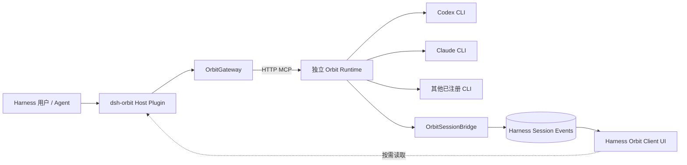

# Orbit × DeepSeek Harness 深度集成计划

| 属性 | 值 |
| --- | --- |
| 状态 | Implementing（独立 Runtime 架构） |
| 日期 | 2026-08-22 |
| Orbit 范围 | 独立 Runtime、MCP/HTTP、事件、Workflow UI、CLI Agent Handler |
| Harness 基线 | `deepseek-ai/deepseek-harness@b150a551b8d465e31e418e1b2eaf5e79bbb7d28e`（`0.1.1-rc.2`） |
| 首要目标 | 让 Orbit 成为 Harness 中可安装、可编排、可观察、可操作的一等 Workflow 能力 |

## 1. 背景与结论

Orbit 已具备 durable Workflow、静态 DSL、版本化 Run、节点级输出、Artifact、人工中断、恢复、HTTP/MCP 和 Web UI。DeepSeek Harness 已具备可安装 Bundle、MCP Client、Subagent Provider、持久 Session Event、动态 Web Client Module、Conversation Node、Settings Card 与 Job 控制面。

二者不应互相替代：

- Orbit 负责 Workflow 定义、DAG 推进、节点状态、幂等、重试、恢复和 Artifact 归属。
- Harness 负责会话、Workspace、Run 投影与用户交互，不负责执行 Orbit 节点。
- Orbit Runtime 独立启动，负责 Agent CLI、凭据继承、权限、子进程和 Workspace 效果。
- Harness Session Event 保存可回放的 Run 摘要；Orbit 始终是 Run 详情和命令权限的事实源。
- UI 采用 Harness 原生 Client Plugin；iframe 只保留为过渡期的“在 Orbit 中打开”入口。

目标调用链：



## 2. 目标

### 2.1 产品目标

1. Harness Agent 可以通过稳定工具启动、查询和控制 Orbit Run。
2. Orbit Run 在 Harness 对话中显示为可回放、实时更新的原生 Run Card。
3. 用户可在右侧详情页查看 Run、步骤、每步指令与输出、执行图、分支和 Artifact。
4. Orbit interrupt 可以在 Harness 会话中请求用户输入并恢复 Run。
5. Orbit 的 Agent 节点由 Runtime 已注册的 CLI Handler 执行。
6. Harness 重启或断线不影响 Runtime 中正在执行的 Run。

### 2.2 工程目标

- 保持 Orbit HTTP/MCP 向后兼容。
- 所有写操作继续使用服务端 `allowed_commands[]`、`expected_version` 和幂等键。
- 日志、Artifact 内容和完整 Graph 不进入 Harness Session Event。
- 外部 Agent CLI 的凭据、版本、进程与权限策略只由 Orbit Runtime 管理。
- 每个长期状态都可在 Host 或 Runtime 重启后重新协调。

### 2.3 非目标

- 不用 Harness 的临时 JS Workflow 替换 Orbit durable Workflow。
- 不让 Orbit DSL 拼接任意 CLI 命令、环境变量或 Harness URL。
- 首版不实现 Codex/Claude Code 原生会话续接、推理过程镜像或交互式 CLI 权限转发。
- 不自动把全部 Orbit Artifact 复制为 Harness Attachment；只在用户显式导入时复制。
- 不在首版原生重写 Orbit Workflow 编辑器和全部运维页面。

## 3. 总体架构

### 3.1 插件内部边界

首版可以发布为一个 Bundle，但代码按三个组件拆分：

```text
integrations/deepseek-harness/
├── package.json
├── cordis.patch.yml
├── src/
│   ├── index.ts
│   ├── host/
│   │   ├── orbit-gateway.ts
│   │   ├── orbit-client.ts
│   │   ├── session-bridge.ts
│   │   └── remote.ts
│   └── client/
│       ├── index.ts
│       ├── run-node.tsx
│       ├── run-detail-drawer.tsx
│       ├── step-output.tsx
│       ├── graph-view.tsx
│       ├── artifact-view.tsx
│       └── settings-card.tsx
└── tests/
```

后续允许拆成：

- `dsh-orbit`：Runtime 发现、Session Bridge、Remote API。
- `dsh-client-ui-orbit`：Conversation Node、详情 Drawer、Settings 和 Dashboard。

### 3.2 OrbitGateway

`OrbitGateway` 是 Harness 与 Orbit 的唯一 Host 边界：

- 根据 Harness Session 的 Workspace Reference 解析 Orbit Project。
- 通过 `orbit runtimes --json` 查找 `project_root` 精确匹配的 Runtime。
- 只连接已由用户启动的 `orbit serve`，不自动启动或停止 Runtime。
- 负责 readiness、版本握手和 HTTP MCP Client。
- 多个 Agent/Session 复用同一 Workspace MCP endpoint。
- 新增数据库级 Runtime ownership：对规范化数据库路径建立跨进程所有权锁、实例身份和 stale-owner 接管规则。Gateway 进程内引用计数不等于该保证；第二个 Harness 实例或用户手工执行 `orbit serve` 也必须经过同一约束。
- 浏览器客户端不得直接访问 `127.0.0.1:8848`，统一经过 Host Remote API。

HTTP MCP 由 Runtime 的 loopback 身份策略授权。`harness` profile 允许 Gateway 在 `/mcp` 上用 `x-orbit-actor` 将同一本机操作者细分为 `harness:session:*`；非 loopback、非 MCP 路径、越界前缀和非法字符全部拒绝。该 actor 不增加本机操作者原本没有的 scope，但使事件查询和 `single_goal_mode` 按 Session 隔离。

当前已选择每个 Harness Session 一个 scoped actor；不关闭 `single_goal_mode`，也不引入 Execution Lease。该方案允许不同 Session 与 Orbit UI 分别持有活跃 Run，但同一 Session 内仍由 Orbit 串行活跃 Goal。若未来要求同一 Session 并发，应单独改造 single-goal slot，而不是通过伪造更多 actor 绕过产品语义。

### 3.3 事实源

| 数据 | 权威来源 | Harness Session 是否持久化 |
| --- | --- | --- |
| Run 状态摘要 | Orbit | 是，使用可回放快照 |
| Step 详情 | Orbit | 否，按需读取 |
| Graph / Edge | Orbit Workflow 版本，Run snapshot 覆盖 | 否，按需读取 |
| 节点输出 | Orbit sensitive API | 否，游标跟随 |
| Artifact 元数据 | Orbit | 卡片仅保存数量/摘要 |
| Artifact 内容 | Orbit Artifact Store | 否 |
| 可执行操作 | Orbit `allowed_commands[]` | 否，每次操作前重读 |
| Agent CLI Job | Orbit Runtime | Harness 只读取所属 Step 状态 |

## 4. 接口与协议改造

### 4.1 MCP 兼容层（P0）

当前 Harness MCP Client 默认工具超时为 60 秒。Orbit Service 已经实现 `goal` 和 `wait: bool = True`，其中 `wait: false` 会在 Run 创建后立即返回；缺口位于 MCP Adapter，没有必要改造 Runtime 执行协议。首版必须：

1. 在 MCP `start_run` 的 input schema 中暴露 `goal` 和 `wait`，调用 Service 时原样传递；Harness 默认使用 `wait: false`。
2. 所有运行工具返回 JSON Schema 描述的 `structuredContent`，同时保留文本 `content` 兼容旧客户端。
3. 定义 MCP/HTTP 共用的公共 Run DTO，至少对齐 `goal`、`template_id`、`agent_binding`、`artifact_count` 和 `allowed_commands[]`，以及已有的状态、结果、interrupt、错误和时间字段。内部授权字段 `owner_actor` 不因数据类存在而对外暴露。
4. 增加协议能力握手：Orbit 版本、协议版本、支持的事件 schema、工具 profile。
5. 提供最小 `harness` 工具 profile，只公开运行期工具，不默认暴露运维和 Workflow 编写工具。
6. 加入针对 Harness MCP Client 的互操作测试和 60 秒超时测试。

P0 已提供 `get_capabilities` 握手，返回 Orbit 版本、`orbit-harness/1` 集成协议、MCP 协议、事件 schema 和当前工具 profile。`harness` profile 只包含能力发现、Workflow/Run/Artifact 运行期工具。仓库内 `integrations/deepseek-harness` 是可构建的 Host Profile Bundle，按规范化 Workspace 复用 Runtime，并以 Session actor 路由调用。

Harness 官方 `dsh-mcp-client` 的一个实例绑定固定 URL 与静态 headers，不能根据 `ToolRunContext` 动态选择 Workspace 和 Session actor。因此 Bundle 不直接插入一个全局 MCP Client row，而是在 `ctx.tools` 注册 `orbit_list_workflows`、`orbit_list_runs`、`orbit_inspect_run`、`orbit_start_run`、`orbit_cancel_run`、`orbit_resume_run` 六个稳定工具；执行体再通过统一 Gateway 发 MCP。Host 从调用 Agent 推导 cwd/session，写入自己生成幂等键，并在 Cancel/Resume 前重读 `allowed_commands[]`，模型不能提交 URL、actor 或 revision。

`goal` 是 Run Card 和 Orbit 历史列表的主显示文本；缺失时现有 UI 会回退显示 `run_id`，所以它与 `wait`、公共 DTO 对齐都属于 P0 阻断项。

### 4.2 Host Remote API

Client Plugin 只调用 Harness Host 暴露的类型化 Remote：

```ts
interface OrbitRemote {
  getRuntime(workspaceId: string): Promise<RuntimeSummary>
  getRun(runId: string): Promise<RunDto>
  getSteps(runId: string): Promise<Versioned<StepDto[]>>
  getGraph(runId: string): Promise<Versioned<RunGraphDto>>
  getEdges(runId: string): Promise<Versioned<EdgeDto[]>>
  readOutput(input: OutputCursorRequest): Promise<OutputCursorPage>
  listArtifacts(runId: string): Promise<ArtifactSummary[]>
  getArtifact(artifactId: string): Promise<ArtifactDetail>
  executeCommand(input: AdvertisedCommandRequest): Promise<RunDto>
}
```

写入流程：

1. Client 发送 `runId`、`command` 和业务 payload，不发送任意 URL。
2. Host 重新读取最新 Run DTO。
3. Host 在 `allowed_commands[]` 中匹配命令并校验目标 Aggregate。
4. Host 生成或复用本次用户意图的幂等键，提交 `expected_version`。
5. 版本冲突返回“状态已变化”，Client 刷新而不是盲目重试。

### 4.3 Session Event

`OrbitSessionBridge` 在 HTTP Runtime 上可订阅 `/events`（WebSocket）；Host Gateway 管理的 stdio Runtime 使用等价的 `list_runtime_events` 增量 MCP 工具。两者读取同一 actor-scoped 事件表和 position，不建立第二事实源。原始事件只是重读提示，不直接写入 Harness；Bridge 读取权威 DTO、节流后写入三个事件族：

Orbit 的事件流已经同时携带 Run 级和节点级事件——`langgraph_run.{status}` 与 `langgraph_node.{outcome}`（后者带 `node_id` 和 `attempt_id`），二者在同一条流里按发生顺序排列。这是 Checkpoint 的 `currentSteps` 无需轮询即可保持新鲜的机制，也是节流窗口的输入来源：一个 Run 在节点密集推进时会产生远多于状态变化的提示，合并策略针对的正是这一段。

```ts
type OrbitRunStarted = {
  type: 'orbit/run-started'
  sourcePosition: number
  runId: string
  workspaceId: string
  goal: string
  workflowId: string
  workflowVersion: number
  revision: number
  status: string
  createdAt: string
}

type OrbitRunCheckpoint = {
  type: 'orbit/run-checkpoint'
  sourcePosition: number
  runId: string
  revision: number
  status: string
  currentSteps: StepSummary[]
  stepCounts: Record<string, number>
  interruptSummary?: InterruptSummary
  artifactCount: number
  updatedAt: string
}

type OrbitRunEnded = {
  type: 'orbit/run-ended'
  sourcePosition: number
  runId: string
  revision: number
  status: string
  resultSummary?: string
  errorSummary?: string
  artifactCount: number
  updatedAt: string
}
```

约束：

- `runId` 是 Conversation Node 的稳定业务 ID。
- Checkpoint 是完整摘要快照，不是依赖前序事件的 patch。
- Terminal Event 能在缺少 Start Event 时独立构造终态节点。
- 同一 Run 高频变化合并，目标频率不高于每 500ms；终态立即写入。
- `sourcePosition` 是 Orbit 事件流位置；Bridge 持久化最后确认位置，重连从下一位置续读。合并后的 Checkpoint 使用窗口内最大位置，同一 Run 对旧位置幂等忽略。
- 事件只保存展示安全的信息，不保存输入正文、日志、Artifact 内容和命令 URL。
- Orbit `/events` 必须按已认证 actor 在数据库查询层过滤；不能先把其他 actor 的事件读到 Host 再丢弃。

## 5. 外部 Agent 的执行边界

当前方案不让 Harness 执行 Orbit 节点，也不让 Orbit 回调 Harness Subagent。Workflow 中的 Agent 节点由独立 `orbit serve` 在 Runtime 启动时发现并注册的 CLI Handler 执行；CLI 凭据、沙箱、并发、超时、取消、进程树回收和副作用判断都归 Orbit 所有。

Harness 只承担三件事：通过 MCP 启动/操作 Run；把 actor-scoped Runtime Event 投影到 Session；在 UI 中展示 Run、Step、Output 和 Artifact。Harness 断开或重启不改变已运行节点的所有权，也不会导致 Runtime 重新派发 Agent。

Workflow DSL 继续使用既有 `action` 节点和严格 `HandlerRef`：

```yaml
id: implement_login_fix
kind: action
handler:
  name: agent.codex
  version: 1.2.3
config:
  prompt: 实现并测试登录接口
  timeout_seconds: 1800
```

Handler 必须在 Runtime Registry seal 前注册；CLI 安装、移除或版本变化后需重启 Runtime 才能形成新的已固定 manifest。Agent Handler 为 `UNKNOWN_ON_LEASE_LOSS`，因此不得附加 Orbit Retry Policy；编译器负责拒绝非 retry-safe Handler 上的 retry。

旧的 `harness.subagent`、Execution Lease、Delegation Queue 与双层状态机方案仅保留在 P3 历史记录中，不属于当前 Harness Bundle，也不进入新 Run 的执行路径。

## 6. UI 计划

### 6.1 Conversation Run Card（P1）

Agent 启动 Orbit Run 后，本轮对话中出现一张原生 Card：

```text
Orbit Workflow
修复登录接口偶发 500

● 运行中       4 / 7 步
✓ 分析日志
✓ 定位事务问题
● 修改代码 · Codex Safe
○ 执行测试

[查看详情] [取消]
```

Card 只展示 Goal、Workflow、状态、步骤计数、当前步骤、interrupt/error 摘要、Artifact 数量，以及最新 DTO 允许的操作。

必须通过以下回放测试：

- 完整事件历史；
- 先加载末页再 prepend 旧页；
- Live append；
- 只有 terminal event；
- 重复 checkpoint；
- Run 更新快于 UI 动画。

### 6.2 Run Detail Drawer（P2）

点击 Card 或历史记录后，在 Harness 右侧打开原生详情页：

1. 概览：Goal、状态、Workflow 版本、Agent binding、时间。
2. 结果：主结果、错误和 interrupt。
3. 步骤：状态、指令、Attempt、Runtime Agent Handler 和 Workspace。
4. 输出：拆到每个步骤中，按需读取。
5. Graph：绘制该 Run 实际执行的定义（见 6.2.1）。
6. Branch：显示实际选择和跳过的 Edge。
7. Artifact：缩略图、元数据、预览和下载。
8. 操作：Resume、提交人工输入、Cancel（见 6.2.2）。

“查看输出”明确拆分为：

- **指令**：该节点收到的任务；
- **进度**：安全阶段和时间信息；
- **最终答复**：Agent 的 final answer；
- **原始输出**：stdout/stderr，需要 sensitive scope，按游标读取。

默认展开最终答复，不默认加载原始输出。

#### 6.2.1 Graph 从哪里读

`graph_snapshot_json` 只在 Agent 绑定替换了节点时才写入；执行未改动定义的 Run 该字段为 NULL。权威是 Run 引用的 Workflow 版本，snapshot 只是"发生过替换"时的覆盖。Orbit Service 已在 `_ir_for` 中处理这一回退，`getGraph(runId)` 两种情况都返回正确结果——实现时不要把空 snapshot 当作缺数据。

#### 6.2.2 可用操作只有服务端 advertise 的那些

Run 上 advertise 的命令只有 `langgraph_run.resume` 和 `langgraph_run.cancel`。**Orbit 没有 retry 命令**：retry 是节点上的编译期策略，不是用户可触发的操作；非 retry-safe Agent Handler 上的 retry 会被编译器拒绝。

`langgraph_run.recover` 存在但不进 `allowed_commands[]`，且需要 `OPS_WRITE_SCOPE`。在 Harness UI 暴露它会突破 4.1.5 的最小工具 profile，属于独立决策，首版不做。

### 6.3 Human Command（P2）

Orbit 业务 interrupt 映射为 Harness 会话内用户请求：

```text
Orbit 正在等待确认

计划修改 auth/session.py 和 tests/test_session.py。

[允许本次] [拒绝] [补充要求]
```

用户响应必须携带 Session、Run、interrupt 和 revision；Host 重新读取 `allowed_commands[]` 后执行 Resume。外部 CLI 自身的权限请求由 Orbit Runtime 的非交互策略处理，不能与 Orbit interrupt 嵌套。

### 6.4 Settings Card（P2）

设置项包括：

- Runtime：独立进程的发现与连接状态；
- Orbit executable 和 `ORBIT_RUNTIME_ROOT`；
- 默认 Workflow；
- 是否允许展示 sensitive output；
- Runtime 版本和健康状态；
- “在 Orbit 中打开”入口。

秘密值只保存 Credential Reference，不进入普通配置或 Client Bundle。

### 6.5 Orbit Workspace（P3）

逐步原生化 Goals/Runs、Workflow Catalog、Artifact Catalog、Runtime 状态和 Workflow 编辑。P1/P2 期间保留现有 Orbit UI 作为高级管理入口，不使用 iframe 冒充最终集成。

## 7. 分阶段实施

### P0：协议与 Host 基础

当前仓库内基线（`codex/deepseek-harness-p0`）：

- 已完成：MCP `goal` / `wait`、公共 Run DTO、`structuredContent` / `outputSchema`、`harness` profile、能力握手、跨进程数据库 OS ownership lock、Runtime endpoint 发布、Workspace Gateway、Host Remote 与 Profile Bundle。
- 已完成测试：MCP/HTTP 契约、profile、actor 事件隔离、ownership 互斥与 CLI surface。
- 已验证：独立 TypeScript build、npm pack、Gateway MCP 契约测试，以及临时 Workspace 中真实 `orbit serve` 的发现、双 Session actor 调用和 Host release 后 Runtime 存活。transport loss 会清除 endpoint cache，下一次调用重新发现重启后地址。另已在隔离的 DeepSeek Harness `0.1.0-rc.6` Web Profile 中通过本地 Bundle 安装、配置合成、Host/Web 启动（HTTP 200）和卸载无残留冒烟。

交付：

- Harness MCP compatibility profile。
- MCP `start_run` 暴露 Service 已有的 `goal` / `wait` 参数，Harness 默认 `wait=false`。
- 结构化 MCP 结果，以及 MCP/HTTP 公共 Run DTO 对齐：`goal`、`template_id`、`agent_binding`、`artifact_count`、`allowed_commands[]`。
- OrbitGateway、Runtime 发现、版本握手和健康检查。
- actor/single-goal 并发方案及其授权边界。
- 数据库级 Runtime ownership 与跨进程互斥。首版使用内核持有的非阻塞文件锁：进程退出后由 OS 自动释放，不实现依赖 heartbeat 的强行 steal；锁文件 JSON 仅用于诊断。
- Host Remote 查询 API，以及供 P1 Cancel/Resume 使用的受限 `executeCommand`；写接口只接受服务端 advertise 的命令，不接受任意 URL。
- Agent 原生工具面；`start` 固定 `wait=false`，Cancel/Resume 由 Host 获取最新 revision。
- Bundle 安装、启动和卸载冒烟测试。

验收：

- Harness 可在 60 秒工具超时内创建后台 Run。
- Harness 启动的 Run 在 Orbit 历史和 Run Card 中保留原始 Goal，不回退显示 Run ID。
- 同一 Workspace 多 Session 复用一个已发现 endpoint；Harness 不取得 Runtime 数据库执行所有权。
- Harness Run 不与 Orbit UI 的活跃 Goal 因共享 actor 意外冲突，并发行为符合选定的 single-goal 方案。
- Runtime 不在线时返回可诊断错误，Host 不阻塞。
- HTTP 与 MCP 对同一 Run 返回一致的公共 DTO；`owner_actor` 等内部字段不对外暴露。

### P1：会话原生集成

当前实现基线：

- `list_runtime_events` 与 `get_run_steps` 已进入 `harness` MCP profile，事件在查询层按 Session actor 隔离。
- `OrbitSessionBridge` 按 position 续读、按 Run 合并 500ms 窗口、终态立即写入，并仅持久化展示安全的快照字段。
- Host 对启动时恢复和新建的 root Session 自动挂载 Bridge；Session disposal 中止轮询。cursor 与 known Run 从持久化的 `orbit/run-*` 事件重建，不引入第二个 cursor 数据库。
- Bridge 在首次观察到任意 Run（包括只观察到终态）时先补 `orbit/run-started`，保证 Conversation assembler 始终具有唯一 start。
- Web Client 已提供 `orbit-run` Conversation Node definition、`sourcePosition` 幂等 reducer 和基础 Run Card renderer；详情能力在 P2 基线上继续增强。

交付：

- OrbitSessionBridge。
- `orbit/run-*` Event schema。
- Conversation Node reducer 和 Run Card。
- Run Card 的查看详情和 Cancel 入口。
- 事件节流、断线续读与去重。

验收：

- 刷新浏览器、重启 Harness、分页加载历史后 Card 状态一致。
- Session Event 中不存在日志正文、Artifact 内容和命令 URL。
- Cancel 始终通过最新 `allowed_commands[]` 执行。

### P2：详情、人工介入与设置

当前实现基线：

- Harness MCP profile 已投影 Run Graph、Edges、Steps 和 sensitive-scope 的游标输出；Host Remote 同时提供 Artifact 元数据读取。
- Run Card 已可打开右侧原生 Drawer，按 Step 展示指令、状态和该节点输出，并展示 Graph、Edge 与 Artifact 摘要。
- Resume 表单只在最新 Run DTO advertise `langgraph_run.resume` 时出现；Host 执行前仍会重新读取 `allowed_commands[]` 和 revision。
- General Settings 已提供按最近 Workspace 探测的 Orbit Runtime 连接状态。
- Artifact 内容通过 Host Remote 做 2 MiB 上限的 base64 代理，Client 不接触 Orbit loopback 地址；超限明确降级而不截断文件。
- 原始输出按 Step 展开后才从该节点 cursor 读取；运行中续读，折叠或卸载立即停止轮询，并按 `chunk_id` 去重排序。
- Drawer 以 Session/Run 键恢复刷新前的打开状态，支持 Escape、Tab 焦点环和关闭后焦点归还。

交付：

- 右侧 Run Detail Drawer。
- 步骤级输出、Graph、Edge、Artifact。
- Resume/Human Command。
- Settings Card。
- sensitive scope 和 Artifact 内容代理。

验收：

- 每个步骤可独立查看指令、最终答复与原始输出。
- 输出翻页/跟随不重复、不漏读，关闭折叠后停止轮询。
- stale revision 提示刷新，不重复执行命令。
- 没有 sensitive scope 时 UI 明确降级且不泄漏内容。

### P3：Harness Subagent 执行桥（已取消）

本节以下内容是旧方案记录，不再是目标架构。Harness Host 不再启动 delegation worker，也不调用 `ctx.subagents`。独立 `orbit serve` 使用 Runtime 自身发现并注册的 CLI Handler 执行节点。历史 Queue/Lease 数据继续可读以兼容旧 Run，但不进入新 Harness Session 的执行路径。

<details>
<summary>已取消方案的历史实现记录</summary>

当前实现基线：

- Orbit 在 MCP Runtime seal 前固定注册 `harness.subagent@1.0.0`；manifest 为 `action` Handler，Provider、墙钟预算和 Effect Manifest 位于 `config`。
- durable Delegation Queue 使用确定性 delegation ID；重复请求只关联同一记录，不同 actor 无法 claim。
- Harness Host 通过 `configure_execution_lease` 从实时 Provider Registry 固定 actor-scoped allowlist、Workspace 和预算；worker 再通过 `claim_delegation` / `renew_delegation` / `complete_delegation` 持有单次 Job Lease，并调用现有 `ctx.subagents.start(provider, ...)`，因此 Provider 新增/移除不改变 Orbit Registry。
- claim 在一个 `BEGIN IMMEDIATE` 事务中校验 Execution Lease 并扣减 `max_delegations`；未配置、过期、Provider 越权、墙钟越界和预算耗尽均在 Provider 启动前落为已知失败。
- lease 过期不重新排队，直接落为 `unknown`；运行投影继续使用 `resolution.kind=reconciliation_required` 语义，不新增节点状态。
- `get_run_steps` 在 Harness attempt 为 `unknown` 时返回结构化 `resolution: {kind: reconciliation_required, delegation_id}`；Drawer 明确提示人工核对且不会自动重试，不再依赖解析错误文本。
- 人工可通过 `reconcile_delegation` 将外部证据记录为 `confirmed_succeeded` 或 `confirmed_failed`；结论按 actor 隔离并由 idempotency key 去重，只作为步骤的 `reconciliation` 审计旁路返回，原 attempt/run 继续保持 `unknown`，不会恢复或重跑。
- Host Gateway 对 Run、Step、Edge、Output、Artifact、Delegation 等核心 MCP DTO 做运行时 codec 校验；TypeScript 类型断言不再是协议边界，畸形响应在进入 Session/UI 前失败。
- Orbit cancel 会在 delegation 上设置 `cancel_requested`；Harness renewal 观察后 abort Provider 并执行其 `dispose()`。
- `harness.subagent` 的 LangGraph binding 明确 `retry_safe=False`，挂 Retry Policy 的 Workflow 仍由编译器拒绝。

- Host 在启动前从实时 `ctx.subagents.list()` 校验 Provider；不存在时以已知失败结算，不尝试 CLI fallback。
- Codex、Claude Code 与 ACP 共用同一 Provider-neutral 启动契约；Host policy matrix 已覆盖已注册/未注册 Provider、读写模式、Workspace isolation mismatch 和并发越界，策略拒绝均发生在 `subagents.start()` 之前。
- Host lifecycle 故障注入覆盖 Provider 启动前失败、发布后 result transport loss、Job Lease renewal loss、取消和正常完成：启动前失败只结算一次；发布后或续租丢失不结算，等待 Orbit 将 Lease 置为 `unknown`；所有已发布句柄最终只 `dispose()` 一次。
- Gateway 进程 fixture 覆盖同 Workspace 并发 acquire 去重、协议版本不兼容、畸形 JSON 和非零退出；所有 pending RPC 在子进程退出时立即失败并携带退出码/信号，不等待请求超时。
- `effects=write` 只有在 Host Workspace 实际标记为 `exclusive/worktree` 且与节点请求一致时才允许启动；当前 worker 强制 `max_concurrency=1`，不能满足的 Workflow 在 Handler validation 阶段失败。
- Host 对 Git Workspace 做执行前后快照，输出 changed/created/deleted、base/final revision 和观察可信等级；已脏文件再次变化通过内容摘要识别。声明只读却产生文件变化时按策略失败。

取消时仍未完成的内容包括 Harness Workspace Service worktree 管理、Provider 内部调用计量和真实 Provider 组合故障注入；新架构不再追踪这些 Harness Provider 工作项。

交付：

- `harness.subagent` Handler。
- Handler 在 Runtime seal 前的注册与 Provider 运行时解析边界。
- Execution Lease 和 Delegation Queue。
- Codex、Claude Code、ACP Adapter。
- 确定性 delegation ID。
- 双层状态机，以及 `unknown + resolution.kind=reconciliation_required` 协调模型。
- Workspace isolation 与 Effect Manifest。
- 调用次数、并发和墙钟预算。

验收：

- 网络超时或 Orbit 重启不产生重复 Agent Job。
- `harness.subagent` 默认是 `UNKNOWN_ON_LEASE_LOSS`，带 Orbit Retry Policy 的 Workflow 在编译期得到明确错误；未证明 replay-safe 前不得放宽。
- Runtime seal 后新增 Harness Provider 不要求动态注册新 Orbit Handler；如果 `harness.subagent` Handler 本身缺失，则明确要求重启 Runtime。
- 取消 Run 能终止仍受 Harness 管理的子进程树。
- 未知外部结果进入人工协调，不能自动重跑。
- 并行写节点位于不同 worktree。
- UI 只显示一个 Orbit Step，Harness Job 作为其执行详情，不重复生成聊天卡片。

</details>

### P4：完整工作区与产品化

当前实现基线：

- `/orbit <goal>` 注册到 Harness 原生 slash-trigger pipeline；Host 以原生 `command/run` / `command/done` 生命周期记录请求和收口，客户端用 Session Storage 恢复当前浏览器中的未完成弹窗。浏览器只调用同源 Host API，Host 在启动前重新校验 ready Workflow 及其版本，并从命令事件取得 Goal。
- Host 从 Session cwd 反查 Harness WorkspaceRegistry，把稳定 Workspace ID、canonical path 及可用的隔离元数据放进每次 MCP `tools/call` 的 `orbit/workspace` metadata；`/orbit` 启动时再次核对客户端回传值与 Session 权威 Workspace，浏览器不能选择另一个目录。
- Harness 注册原生 `Orbit` Settings Section，提供 actor-scoped Run 历史、Workflow Catalog、Artifact Catalog 和诊断页；历史详情沿用右侧 Drawer 交互，读取 Steps、逐节点输出、Graph、Edges 和 Artifact。
- Workflow 页面通过新增的 `generate_workflow` / `modify_workflow` / `get_authoring_job` Harness MCP 工具启动并轮询 Orbit 自有 Authoring Job；DSL 生成、编译、发布与 Handler 校验仍由 Runtime 完成。
- 图片 Artifact 可通过 Host Remote 显式导入 Harness `AttachmentStore`；类型、base64 和 Attachment admission 在写入前校验。当前 Harness Attachment API 只接受 PNG/JPEG/WebP/GIF，其他 Artifact 明确保留在 Orbit，不伪装为 Attachment/Deliverable。
- Gateway 记录发现、RPC、transport failure、最近连接时间；Session Bridge 记录连接状态、cursor 和去重后的最近错误。诊断页可复制或下载不含 endpoint、凭据和正文的 JSON 包。
- GitHub Release 构建 Bundle tarball；兼容矩阵、升级/回滚、源码目录与 tarball Profile 冒烟命令已进入用户文档；Linux/macOS/Windows CI 覆盖 Runtime ownership、安全边界和真实 HTTP MCP E2E。

交付：

- Harness 原生 Orbit 历史和 Catalog 页面。
- Artifact 显式导入 Harness Attachment/Deliverable。
- Workflow 编辑/生成入口。
- Telemetry、诊断包和升级迁移。
- 发布、版本兼容矩阵和用户文档。

验收：

- 用户无需离开 Harness 即可浏览当前 Session 的 Run、Workflow 和 Artifact，并从历史打开完整 Run Drawer。
- 用户输入 `/orbit <goal>` 后必须先选择一个已发布且 ready 的 Workflow；刷新页面后未完成选择仍可恢复，选择或取消后由原生命令生命周期收口。
- 新建、修改和重新生成 Workflow 均只创建一个可恢复 Authoring Job，UI 轮询终态并展示编译诊断。
- Artifact 导入不会绕过 Harness 图片 admission；不支持的媒体类型得到明确错误。
- 诊断包不含 Runtime MCP URL、actor header、原始输出、Artifact 内容或凭据。
- Bundle 可从 GitHub Release tarball 安装、启动和无残留卸载。

## 8. 测试策略

### 8.1 契约测试

- MCP tool schema、`structuredContent` 和错误形态。
- MCP `goal` / `wait` 参数向 Service 的透传。
- HTTP/MCP 公共 Run DTO 一致性及内部 `owner_actor` 不暴露。
- `allowed_commands[]`、`expected_version`、幂等键和显式确认。
- Event schema 的向前/向后兼容。
- Harness Remote 输入长度、ID、Workspace 和权限校验。

### 8.2 生命周期测试

- 首次启动、复用、并发启动、健康失败、异常退出和正常回收。
- Harness 重启、Orbit 重启、WebSocket cursor 恢复。
- Runtime 已存在但版本不兼容。
- Workspace 被删除、移动或不可访问。
- 同一 Harness 进程、第二个 Harness 进程和手工 `orbit serve` 三种路径下的数据库 ownership 防护，以及进程退出后的 OS 自动释放。

### 8.3 状态与故障注入

- MCP 提交前断线、提交后响应丢失和幂等重试。
- Runtime 停止、换端口重启、endpoint cache 失效和重新发现。
- Session Bridge cursor 恢复、重复 Event、损坏历史 Event 和终态竞态。
- 非 retry-safe Runtime Agent Handler 携带 Retry Policy 时的编译拒绝。
- Run Deadline、CLI Handler 超时、取消和并发限制。

### 8.4 UI 测试

- Conversation Node 全量回放、prepend 和 live append。
- Run Card 全状态视觉和可访问性。
- Drawer 路由、刷新恢复、键盘关闭和焦点管理。
- Step Output 游标、敏感权限、空输出和大输出。
- Artifact 图片、文档、二进制和超限预览。
- Human Command 的批准、拒绝、补充要求和 stale revision。

### 8.5 端到端场景

1. Harness Agent 启动 Orbit Run，Card 实时完成。
2. 独立 Orbit Runtime 的 Agent Handler 调用 Codex/Claude CLI，Harness 只观察结果。
3. 两个分支由 Runtime 按 Workflow 和 Workspace 策略并发执行。
4. Orbit interrupt 在 Harness 会话中请求确认并恢复。
5. Harness 重启后恢复 Card；Orbit 换端口重启后 Gateway 自动重新发现。
6. Harness 断开不取消、不重派 Runtime 已拥有的 Agent 进程。

## 9. 安全与治理

- Orbit DSL 只能引用 Runtime seal 前注册且 manifest 已固定的 Handler。
- Harness 不接受模型或 Browser 提供的 executable、endpoint、actor、环境变量或凭据。
- Agent CLI allowlist、预算和权限模式由 Orbit Runtime 配置固定。
- Client 永远不持有 Orbit 管理 token 或 Agent 凭据。
- 原始输出必须通过 sensitive scope，并执行现有脱敏/大小限制。
- Cancel 和 Resume 只能来自最新 `allowed_commands[]`；危险 Resume 需要显式 UI 确认。
- Session Event 和 Telemetry 只记录安全摘要，不记录任务私密正文。
- Effect Manifest 是观察结果，不宣称可以回滚副作用。

## 10. 可观测性

统一关联字段：

```text
harness_session_id
workspace_id
orbit_run_id
orbit_node_id
orbit_attempt_id
handler_name
handler_version
```

关键指标：

- Runtime 启动成功率与 readiness 延迟；
- Session Event Bridge 延迟、断线和重放数量；
- Run/Node 状态持续时间；
- MCP 幂等命中数；
- unknown/reconciliation 数量；
- Runtime Agent Handler 调用、并发、取消和失败率；
- Remote 和 Output 读取延迟；
- Event 合并前后数量。

日志不得包含凭据、完整任务、原始 Agent 输出和 Artifact 内容。

## 11. 关键风险与缓解

| 风险 | 影响 | 缓解 |
| --- | --- | --- |
| Harness 处于 Developer Preview，插件契约变化 | 编译或加载失败 | 固定基线 commit，建立兼容矩阵和冒烟测试 |
| Orbit 与 Harness 形成循环调用 | 取消、身份和故障归属混乱 | Runtime 独立拥有执行；Harness 仅经 MCP 操作和观察 |
| 外部 Agent 已产生副作用但结果未知 | 重试造成重复修改 | Agent Handler 使用 `UNKNOWN_ON_LEASE_LOSS`，禁止 Orbit retry |
| Harness 与 Orbit UI 共享 actor | 默认 single-goal 互相阻塞 | 独立 profile/session/lease actor，不全局关闭 single-goal |
| 多进程驱动同一 Runtime 数据库 | 重复执行、错误恢复和 checkpoint 竞争 | 数据库 OS ownership lock；活进程不可 steal，退出自动释放 |
| 多 Agent 共享 cwd | 文件竞争和覆盖 | 由 Orbit Workspace/Workflow 策略提供 exclusive/worktree 隔离 |
| 会话事件过大 | 回放慢、泄密 | 只写摘要快照，大内容按需读取 |
| UI 与 Runtime 状态不同步 | 展示错误或执行旧命令 | Event 仅作提示，操作前重读 DTO |
| Agent CLI 权限过宽 | Workspace 或凭据风险 | Runtime 静态 allowlist、最小环境和默认安全模式 |
| Runtime seal 后 Handler/CLI 变化 | 新安装 CLI 不可执行 | 重启 Runtime，生成并固定新的 Handler manifest |

## 12. 待确认决策

以下决策应在相应阶段实现前固化为 ADR 或协议文档。actor/single-goal 和数据库 ownership 的 P0 方案已经选定：

1. 集成代码长期放在 Orbit 仓库还是独立 npm 仓库。
2. **已定：** Gateway 使用 Session-scoped actor。不与 Orbit UI 共用 actor，也不全局关闭 `single_goal_mode`。
3. **已定：** CLI `serve` / `mcp` 对规范化数据库路径取得 OS ownership lock；活进程不可 steal，进程退出由内核释放，手工启动遵循同一规则。非 CLI embedder 必须显式使用同一 ownership helper。
4. Harness Session Event 的字段大小和更新频率上限。
5. Orbit interrupt 与 Harness Human Command 的正式协议边界。
6. 自定义 Runtime discovery root 应长期使用环境变量还是 Bundle 配置 schema。
7. Runtime Agent CLI 安装、移除和升级后的 manifest 迁移体验。

## 13. 首个垂直切片

第一阶段先完成以下可演示、可验证的闭环：

```text
Harness Agent 启动 Orbit Run
→ 对话出现 Run Card
→ Orbit 事件推动步骤状态
→ 点击打开右侧详情
→ 按步骤查看指令和输出
→ 在详情中 Cancel，或在会话中处理 interrupt
→ 刷新 Harness 后从 Session Event 恢复同一张 Card
```

该切片和 P4 产品化入口均已完成；后续只做兼容性维护与体验迭代，不再引入 Harness 反向执行 Orbit 节点。

## 14. 参考

### Orbit

- `src/orbit/web/mcp.py`
- `src/orbit/web/runtime_events.py`
- `src/orbit/web/api_v1/langgraph_runs.py`
- `src/orbit/static/workflow-ui/assets/api.js`
- `src/orbit/static/workflow-ui/assets/views/index.js`
- `src/orbit/workflow/langgraph_runtime/service.py`
- `src/orbit/platform/projects.py`

### DeepSeek Harness

- [MCP Client](https://github.com/deepseek-ai/deepseek-harness/blob/b150a551b8d465e31e418e1b2eaf5e79bbb7d28e/packages/mcp/mcp-client/README.md)
- [Subagent 能力](https://github.com/deepseek-ai/deepseek-harness/blob/b150a551b8d465e31e418e1b2eaf5e79bbb7d28e/packages/subagent/README.zh.md)
- [Codex Subagent](https://github.com/deepseek-ai/deepseek-harness/blob/b150a551b8d465e31e418e1b2eaf5e79bbb7d28e/packages/subagent/subagent-codex/README.zh.md)
- [Claude Code Subagent](https://github.com/deepseek-ai/deepseek-harness/blob/b150a551b8d465e31e418e1b2eaf5e79bbb7d28e/packages/subagent/subagent-claude-code/README.zh.md)
- [ACP Subagent](https://github.com/deepseek-ai/deepseek-harness/blob/b150a551b8d465e31e418e1b2eaf5e79bbb7d28e/packages/subagent/subagent-acp/README.zh.md)
- [Conversation Node](https://github.com/deepseek-ai/deepseek-harness/blob/b150a551b8d465e31e418e1b2eaf5e79bbb7d28e/docs/cookbook/adding-a-conversation-node.md)
- [Settings Card](https://github.com/deepseek-ai/deepseek-harness/blob/b150a551b8d465e31e418e1b2eaf5e79bbb7d28e/docs/cookbook/adding-a-settings-card.md)
- [Client Modules](https://github.com/deepseek-ai/deepseek-harness/blob/b150a551b8d465e31e418e1b2eaf5e79bbb7d28e/docs/subsystems/client-modules.md)
- [Workflow Run UI](https://github.com/deepseek-ai/deepseek-harness/blob/b150a551b8d465e31e418e1b2eaf5e79bbb7d28e/packages/client/ui-workflow-run/README.md)

## 15. 可拆任务清单

以下任务边界已经避免同时修改同一核心模块，可直接建 Issue；括号内为前置依赖。

| ID | 任务 | 仓库 | 主要产物 | 完成条件 |
| --- | --- | --- | --- | --- |
| O-P0-1 | MCP Harness 契约收口 | Orbit | profile、握手、DTO、异步 start | Orbit 契约测试与全量测试通过；真实 Harness MCP Client 在 60 秒内拿到后台 Run DTO |
| O-P0-2 | Runtime ownership | Orbit | CLI `serve`/`mcp` OS lock、诊断 | 两进程竞争只有一个成功；持有进程退出后另一进程可取得锁 |
| O-P0-3 | actor 事件隔离 | Orbit | `/events` 查询层过滤 | 任意 cursor 下均不返回其他 actor 的 Run/Node 元数据 |
| H-P0-1 | OrbitGateway 与 Runtime Discovery | Harness | Workspace 规范化、endpoint 发现、MCP readiness | 多 Session 复用独立 Runtime；不兼容版本快速失败（O-P0-1、O-P0-2） |
| H-P0-2 | Host Remote 契约 | Harness | `orbit` Host service、Typert Remote、输入校验 | Client 不接触 loopback/token；查询和 advertised command 具备严格 codec（H-P0-1） |
| H-P0-3 | Profile Bundle 与互操作门禁 | Harness | 正式 npm Bundle、安装/卸载 smoke、MCP fixture | 干净 Profile 安装后发现最小工具集，卸载后无残留（O-P0-1） |
| H-P1-1 | Session Bridge | Harness | actor-scoped cursor 消费、节流、三类事件 | 断线续读无重复/漏终态；事件不含敏感正文（H-P0-1） |
| H-P1-2 | Conversation Run Card | Harness Client | reducer、卡片、状态与操作入口 | 历史回放、prepend、live append 一致（H-P1-1、H-P0-2） |
| H-P2-1 | Run Detail Drawer | Harness Client | 右侧路由 Drawer、Graph/Step/Artifact | 刷新可恢复；逐步骤输出 cursor 正确（H-P0-2） |
| H-P2-2 | Human Command | Harness Host/Client | interrupt 展示、受限 Resume | stale revision 不执行；按钮来自 schema/安全映射（H-P2-1） |
| O-P3-1 | Runtime CLI Agent 执行加固 | Orbit | 固定 CLI Handler、取消、超时、输出契约 | Harness 断开不影响执行；Runtime 可回收 CLI 进程树 |
| H-P3-1 | 独立 Runtime E2E | Harness/Orbit | 安装、发现、启动 Run、断线恢复 | 真实 Harness 只经 MCP 完成全流程且不产生 Runtime 子进程 |

后续顺序：先完成 `H-P3-1` 真实端到端门禁，再补 Session Bridge 自动挂载，最后加固 Runtime CLI Agent 的跨平台取消与并发策略。
